# 综合农牧业管理系统开发文档（V1.0.8）

> 文档版本：V1.0.8  
> 产品目标版本：V1.0  
> 文档状态：开发执行基线  
> 编制日期：2026-08-14  
> 项目目录：`D:\zongheguanlixitong`  
> 适用对象：产品负责人、开发人员、测试人员、系统管理员和实际业务使用者

## 目录

1. [文档目的](#1-文档目的)
2. [当前项目基线](#2-当前项目基线)
3. [项目愿景与成功标准](#3-项目愿景与成功标准)
4. [开发理念与设计原则](#4-开发理念与设计原则)
5. [用户需求分析](#5-用户需求分析)
6. [功能范围与业务拆分](#6-功能范围与业务拆分)
7. [核心业务流程](#7-核心业务流程)
8. [技术选型及优缺点](#8-技术选型及优缺点)
9. [系统总体架构](#9-系统总体架构)
10. [项目结构设计](#10-项目结构设计)
11. [页面与交互设计](#11-页面与交互设计)
12. [后端设计](#12-后端设计)
13. [数据库设计](#13-数据库设计)
14. [数据分析与可视化设计](#14-数据分析与可视化设计)
15. [分阶段开发计划](#15-分阶段开发计划)
16. [自动化测试与质量门禁](#16-自动化测试与质量门禁)
17. [Bug 管理与修复流程](#17-bug-管理与修复流程)
18. [开发工作流与完成定义](#18-开发工作流与完成定义)
19. [环境、启动与部署设计](#19-环境启动与部署设计)
20. [备份、恢复与数据保留](#20-备份恢复与数据保留)
21. [非功能需求](#21-非功能需求)
22. [风险与应对](#22-风险与应对)
23. [V1 最终验收场景](#23-v1-最终验收场景)
24. [开发前仍需业务确认的事项](#24-开发前仍需业务确认的事项)
25. [后续版本方向](#25-后续版本方向)
26. [术语表](#26-术语表)
27. [参考资料](#27-参考资料)

## 1. 文档目的

本文档是综合农牧业管理系统 V1 的需求、设计、开发、测试和交付基线。后续功能实现、数据库迁移、页面验收、Bug 修复和版本发布均应以本文档为依据；需求发生实质变化时，应修改文档版本并记录变更，而不是只在代码中临时处理。

本文档同时区分两类状态：

- **当前已实现**：已经存在于项目代码或 MySQL 中，并经过检查的能力。
- **V1 目标设计**：后续阶段需要实现并通过验收的能力，不能视为当前已经完成。

### 1.1 版本记录

| 文档版本 | 日期 | 状态 | 说明 |
|---|---|---|---|
| V1.0 | 2026-08-14 | 开发前确认稿 | 汇总现有认证系统、MySQL、Nginx，以及农牧业务、数据分析和分层架构规划 |
| V1.0.1 | 2026-08-15 | 实施更新 | 记录阶段 1、阶段 2 完成及阶段 3 采购入库闭环、`0006` 正式迁移和自动化验收结果 |
| V1.0.2 | 2026-08-15 | 实施更新 | 记录仓库调拨、`0007` 正式迁移、四角色协作验收及桌面与移动端回归结果 |
| V1.0.3 | 2026-08-15 | 实施更新 | 记录生产领退料、成本对象追踪、历史领料成本退回、四角色净耗用验收和发布前备份 |
| V1.0.4 | 2026-08-15 | 测试规范更新 | 要求后续每项功能同时补充可重复的农牧业务模拟数据、异常数据和跨角色协作验收 |
| V1.0.5 | 2026-08-16 | 实施更新 | 记录采购多次部分退货、`0008` 正式迁移、退款与库存成本口径、本地业务日期修复、多角色模拟验收和发布备份 |
| V1.0.6 | 2026-08-16 | 实施更新 | 记录按仓库批号盘点、`0009` 正式迁移、差异调整与快照失效控制、桌面和移动多角色模拟验收及发布备份 |
| V1.0.7 | 2026-08-16 | 实施更新 | 记录效期预警、入出库金额趋势、生产净耗用排行、ECharts 库存分析、多角色模拟验收和发布备份；阶段 3 完成 |
| V1.0.8 | 2026-08-16 | 实施更新 | 记录生猪批次入栏、转舍、死亡、淘汰、出栏、存栏流水、`0010` 正式迁移、多角色模拟验收和发布备份；阶段 4 启动 |
| V1.0.9 | 2026-08-17 | 产品定位与实施更新 | 明确面向家庭农场、小型合作社和单一经营主体；收录五项优化顺序；实现饲喂成本归集、健康/用药、称重和 ADG 代码 |

### 1.2 实施进度更新（2026-08-16）

本节记录代码实施状态，不改变后续章节定义的 V1 需求范围。第 2 节“当前项目基线”保留为立项时快照，实际运行状态以本节和项目 `README.md` 为准。

| 范围 | 状态 | 已交付 | 尚未交付 |
|---|---|---|---|
| 阶段 1：架构升级 | 已完成 | Vue 3、TypeScript、Vite、Element Plus、Pinia、Vue Router；Flask 应用工厂、SQLAlchemy、Alembic、统一 API、安全会话、Waitress、Nginx、MySQL 集成和浏览器测试 | 无 |
| 阶段 2：基础资料与权限 | 已完成 | `0003_farm_membership`、`0004_farm_locations`、`0005_base_catalogs`；农场、成员、圈舍、地块、仓库、单位、养殖与作物品类、作物品种、两层物料分类、物料档案、三种农场角色、当前农场切换、管理员维护、普通用户只读和服务端农场级数据隔离 | 无 |
| 阶段 3：采购与库存 | 已完成 | `0006_inventory_purchase`、`0007_inventory_operations`、`0008_purchase_returns`、`0009_inventory_counts`；供应商、采购草稿与明细、确认过账、多次部分退货、库存单据、库存流水、库存余额、移动平均成本、双仓调拨、生产领退料及成本对象、按仓库与批号盘点、差异原因、过账调整、快照失效保护、临期/过期预警、入出库金额趋势、生产净耗用排行、幂等、版本冲突、角色权限和余额对账 CLI | 无 |
| 阶段 4：生猪管理 | 进行中（生产记录基础完成） | `0010_livestock`、`0011_livestock_production`；批次与存栏、饲喂领料及成本归集、健康/防疫/用药、称重、ADG、角色权限和农场隔离 | FCR、完整批次成本和养殖趋势分析 |
| 数据分析 | 阶段性能力完成 | 管理员账户指标、近六个月注册趋势、ECharts 响应式图表；库存分析；生猪当前存栏、在养批次、累计死亡及淘汰/出栏 KPI | 生猪趋势、死亡率、ADG、FCR、成本，以及种植、销售和经营分析 |
| 质量门禁 | 已建立 | Ruff；pytest 27 项通过、1 项按配置跳过；MySQL 集成 1 项通过；Vitest 4 项通过；ESLint、Vue 类型检查和 Vite 构建通过；桌面与移动 Playwright 6 项通过；浏览器脚本异常、非预期 HTTP 失败、图表像素和响应式截图检查通过；测试库与正式库库存余额对账通过 | 后续模块继续按风险增加固定数据集和业务闭环测试 |

截至本次更新，正式 MySQL 迁移版本为 `0010_livestock`，新增 `livestock_batches` 和 `livestock_movements`。当前存栏与圈舍分布由追加式流水实时计算，不建立可漂移的存栏余额表。发布前无 GTID 备份位于 `backups/agriculture_management-before-livestock-20260816-152746.sql`，SHA256 为 `C22613AB465762C2F467B0CA3CD2E25D2FF26BBFEAF01ECF20C8A0E861999832`。测试库与正式库均通过结构检查，库存余额继续通过流水对账；自动化业务数据仅写入名称以 `_test` 结尾的测试库，正式库两张养殖表发布时均为空。

### 1.2.1 四角色协作验收

当前桌面 Chrome 和 Pixel 7 移动端共用同一条真实业务链验收，各端使用独立账号、农场和单据编号，验证内容如下：

| 角色 | 实际操作 | 权限与结果 |
|---|---|---|
| 系统管理员 | 注册三类业务账号；新建农场、两个猪舍、地块、主仓、分仓、物料分类和批号物料；分配农场角色 | 可管理全局用户和全部农场；业务账号获得明确农场范围 |
| 农场负责人 | 登录所属农场并新建供应商，再将 60 头育肥猪建立批次并入栏一舍 | 右上角显示“负责人”；可维护经营资料和办理入栏，不显示系统用户管理入口 |
| 生产操作员 | 完成既有采购库存链；另将 20 头转入二舍，登记二舍死亡 2、一舍淘汰 1、一舍出栏 10 | 库存链保持主仓 9、分仓 10、圈舍净耗用 3；生猪总存栏 47，一舍 29、二舍 18，死亡 2、淘汰/出栏 11，五条存栏流水可追溯 |
| 只读查看员 | 查看全部基础资料、采购库存与分析，以及生猪批次、圈舍分布和存栏流水 | 右上角显示“查看员”；可核对库存与生猪结果，但不显示任何新建、编辑、过账、退货、调拨、领退料、盘点、批次入栏或存栏变动按钮 |


### 1.3 V1 默认业务边界

由于部分生产模式尚未进一步确认，V1 按以下默认边界设计：

| 业务 | V1 默认范围 | 后续扩展 |
|---|---|---|
| 生猪 | 以育肥猪批次管理为主 | 母猪个体档案、配种、妊娠、分娩、仔猪谱系 |
| 养鸡 | 以肉鸡批次管理为主 | 蛋鸡存栏、产蛋、蛋品分级 |
| 烟草 | 覆盖种植、采收、烘烤、分级 | 合同收购、烟叶质量模型 |
| 大蒜、水稻、油菜 | 复用通用种植周期和农事模型 | 品种专属模板、农机和合同作业 |
| 成本核算 | 按养殖批次、圈舍、种植周期、地块核算 | 单只种猪精细成本、完整会计总账 |
| 部署 | 本机或家庭局域网 Web 系统 | 公网、云部署、移动 App、离线模式 |

如果实际业务包含母猪繁育或蛋鸡生产，应在对应阶段开始前将其升级为 V1 范围，并补充专用数据表和验收场景。

## 2. 当前项目基线

截至本文档编制日，项目是一个可运行的认证原型，业务模块尚未开始建设。

| 项目项 | 当前状态 | 证据或说明 |
|---|---|---|
| 前端 | 原生 HTML、CSS、JavaScript 单页 | `frontend/index.html`、`frontend/css/style.css`、`frontend/js/app.js` |
| 后端 | Flask 单文件应用 | `backend/app.py` |
| 反向代理 | Windows Nginx，监听 8080，代理 `/api/` 到 5000 | `nginx/conf/nginx.conf` |
| 数据库 | MySQL `agriculture_management` | 当前仅有 `users` 表 |
| 数据访问 | PyMySQL，参数化 SQL，事务手动提交或回滚 | 应用账号仅具备业务 DML 权限 |
| 认证 | 注册、登录、会话恢复、退出、记住登录 | Cookie Session，密码使用 Werkzeug 安全哈希 |
| 测试 | 3 个认证自动化测试 | 当前测试使用临时 SQLite，尚无 MySQL 集成测试 |
| 启停 | `start.ps1`、`stop.ps1` | 启动脚本检查端口、后端健康和 Nginx 配置 |
| 备份 | 原 SQLite 迁移文件及迁移前备份仍保留 | 仅作历史备份，不是运行数据库 |
| 未实现 | 农场、圈舍、地块、库存、养殖、种植、销售、成本、分析 | 全部属于后续阶段 |

当前 MySQL `users` 表结构如下：

| 字段 | 类型 | 约束 | 用途 |
|---|---|---|---|
| `id` | `BIGINT UNSIGNED` | 主键 | 用户标识 |
| `username` | `VARCHAR(20)` | 非空、唯一 | 登录账号 |
| `display_name` | `VARCHAR(20)` | 非空 | 显示姓名 |
| `password_hash` | `VARCHAR(255)` | 非空 | 密码哈希，禁止存储明文 |
| `role` | `VARCHAR(32)` | 非空，默认 `operator` | 当前全局角色，后续迁移为农场成员角色 |
| `created_at` | `DATETIME` | 非空 | 创建时间 |
| `last_login_at` | `DATETIME` | 可空 | 最近登录时间 |

## 3. 项目愿景与成功标准

### 3.1 项目愿景

建立一套真正服务家庭农牧生产的系统，使养殖、种植、库存、采购、销售和成本数据只录入一次、相互关联、可追溯，并最终形成可靠的经营分析，而不是只做一组互不关联的登记页面。

### 3.2 核心目标

1. 覆盖生猪、鸡、烟草、大蒜、水稻和油菜的日常生产管理。
2. 使用统一的农场、仓库、库存、客户、供应商、销售和成本能力，避免每个品类重复开发。
3. 从采购、领用、生产、采收或出栏到销售形成完整数据链。
4. 让经营者随时掌握存栏、产量、库存、成本、收入和利润。
5. 新增相似农牧品类时主要通过配置和通用流程完成，而不是复制整套模块。
6. 保证数据权限、审计、备份、恢复和自动化测试达到可长期使用的水平。

### 3.3 V1 成功标准

| 编号 | 成功标准 |
|---|---|
| S-01 | 可完整跑通一个育肥猪批次从入栏、饲喂、防疫、称重到出栏销售 |
| S-02 | 可完整跑通一个烟草种植周期从整地、移栽、投入、采收到烘烤分级 |
| S-03 | 肉鸡、大蒜、水稻、油菜可以复用共享模型建立生产档案 |
| S-04 | 已过账库存流水汇总与页面库存余额一致率为 100% |
| S-05 | 批次成本、亩成本、收入和毛利可以下钻到来源单据 |
| S-06 | 核心页面同时支持桌面浏览器和手机浏览器，文字、按钮和表格不重叠 |
| S-07 | 每个阶段均具备自动化回归测试，核心业务服务层覆盖率不低于 80% |
| S-08 | 能从备份恢复到一套空环境，并通过登录和核心数据抽查 |

## 4. 开发理念与设计原则

### 4.1 业务闭环优先

每个模块必须形成可验收的业务闭环。例如“生猪管理”不是只建立猪批次表，而是至少完成入栏、存栏变化、物料消耗、健康记录、称重、出栏、成本和分析的贯通。

### 4.2 一次录入，多处使用

采购过账后自动形成库存增加；饲料领用自动形成库存减少和养殖批次成本；销售过账自动形成出库、收入和客户往来。禁止要求用户为同一事实在多个模块重复录入。

### 4.3 共享平台与专业模型并存

- 共享能力：农场、人员、圈舍、地块、仓库、物料、库存、采购、客户、销售、任务、成本、附件和审计。
- 养殖能力：生产批次、数量变动、饲喂、健康、称重。
- 种植能力：种植周期、农事操作、投入品、采收、分级。
- 专业扩展：烟草烘烤与分级，未来的母猪繁育和蛋鸡产蛋。

不建立一张包含所有业务字段的“万能表”，也不为猪、鸡和每一种作物分别复制完整系统。

### 4.4 模块化单体优先

V1 使用一个 Flask 应用和一个 MySQL 数据库，按业务模块拆分代码。模块边界清晰但仍在同一进程中完成事务，便于开发、部署、调试和数据一致性控制。只有在用户量、数据量或团队规模证明有必要时，才考虑微服务、消息队列和独立数据仓库。

### 4.5 分析能力随业务一起建设

每个业务阶段都必须同时定义：原始数据、指标口径、分析接口、ECharts 图表、下钻页面和对账测试。分析页面不直接读取前端拼接的数据，也不能以手工维护的数字作为经营依据。

### 4.6 业务记录可追溯

已过账的库存、销售和成本记录原则上不物理删除。错误通过作废或冲销单纠正，并保留操作人、时间、原因和前后值。

### 4.7 渐进式复杂度

V1 暂不引入 Redis、Celery、Kafka、Elasticsearch、ClickHouse 和微服务。小数据量时直接使用 MySQL 聚合；只有统计查询持续超过性能目标或数据规模显著增长时，才增加汇总表或分析数据库。

### 4.8 可测试和可恢复

业务公式、库存过账、权限边界和数据迁移必须具有自动化检查。任何数据库结构变更前必须备份，任何发布都必须能够明确回退应用版本或通过修复迁移前进。

## 5. 用户需求分析

### 5.1 用户角色

| 角色 | 主要目标 | 高频操作 | 关注内容 |
|---|---|---|---|
| 农场负责人 | 掌握整体经营并作出决策 | 查看工作台、审批或过账、查看利润 | 存栏、产量、成本、现金、风险提醒 |
| 生产管理员 | 安排和检查养殖、种植工作 | 建批次、建种植周期、安排任务、核对记录 | 进度、异常、投入、产出 |
| 养殖操作员 | 快速完成日常养殖记录 | 饲喂、防疫、用药、称重、死亡或转舍登记 | 今日任务、圈舍和批次 |
| 种植操作员 | 快速记录田间作业 | 播种、移栽、施肥、灌溉、用药、采收 | 地块、天气备注、投入品和工时 |
| 仓库或采购人员 | 确保物料账实一致 | 采购、入库、领用、退库、盘点 | 当前库存、批次、保质期、低库存 |
| 财务或经营查看者 | 核对收支和经营结果 | 录入收付款、查看成本和利润报表 | 单据来源、应收应付、毛利 |
| 系统管理员 | 保证账号、权限和系统可用 | 创建用户、授权、备份、查看日志 | 安全、审计、运行状态 |

### 5.2 用户使用原则

- 首页首先展示今天需要处理的事情和异常，而不是宣传性内容。
- 日常录入尽量在一个页面或抽屉中完成，常用字段提供默认值、上次值和模板。
- 业务语言使用“头、只、批、栋、亩、公斤、斤”等用户熟悉的单位，同时在数据库中保存明确的标准单位和换算关系。
- 列表均支持搜索、组合筛选、排序、分页、导出和查看详情。
- 详情页使用时间线展示生产过程，使用户能从结果追溯到每次操作。
- 手机端优先保障查询、任务处理和快速录入；大批量维护、盘点和复杂报表优先桌面端。
- 删除、作废、过账、关账和批量操作必须二次确认，并清楚说明影响。

### 5.3 典型用户故事

| 编号 | 用户故事 | 验收重点 |
|---|---|---|
| US-01 | 作为负责人，我希望打开首页就看到猪鸡存栏、作物面积、库存预警和近期收支 | 数据来自真实业务记录，可按农场和日期筛选 |
| US-02 | 作为养殖员，我希望选中猪批次后快速登记当天饲料和异常死亡 | 自动扣减库存并更新批次成本和存栏 |
| US-03 | 作为种植员，我希望在地块下登记施肥、农药和人工 | 投入品关联库存，费用进入对应种植周期 |
| US-04 | 作为仓管员，我希望盘点后看到账面数、实盘数和差异 | 盘点确认后自动形成有依据的调整流水 |
| US-05 | 作为负责人，我希望比较不同猪批次的料肉比和利润 | 指标口径一致，可点击图表查看原始记录 |
| US-06 | 作为负责人，我希望看到不同地块和作物的亩产、亩成本 | 面积、产量、成本单位统一，异常值有提示 |
| US-07 | 作为管理员，我希望限制普通人员修改已过账单据 | 前端隐藏操作，后端再次强制校验权限 |
| US-08 | 作为用户，我希望误填数据后可以纠正且知道是谁改的 | 作废或冲销保留原因，审计日志可查询 |

## 6. 功能范围与业务拆分

### 6.1 功能优先级

- **Must**：V1 必须交付，否则无法形成主要业务闭环。
- **Should**：V1 应交付，可在核心闭环稳定后完成。
- **Could**：保留接口或设计空间，不作为 V1 上线条件。

### 6.2 功能模块清单

| 模块 | 优先级 | 主要功能 | 关键输出 |
|---|---|---|---|
| 认证与权限 | Must | 登录、退出、会话、用户、农场成员、角色、操作权限 | 当前用户和权限集合 |
| 工作台与任务 | Must | 今日任务、异常提醒、关键指标、快捷入口 | 待办和经营概览 |
| 农场基础资料 | Must | 农场、圈舍、地块、仓库、单位、品类、物料 | 所有业务共享主数据 |
| 供应商与采购 | Must | 供应商、采购草稿、确认入库、退货、单据查询 | 采购成本和库存增加 |
| 库存管理 | Must | 入库、领用、退库、调拨、盘点、批号、有效期、预警 | 可核对的库存余额和流水 |
| 生猪管理 | Must | 批次、入栏、转舍、饲喂、防疫、用药、称重、死亡、淘汰、出栏 | 存栏、生产记录和批次成本 |
| 通用种植 | Must | 地块周期、计划、农事、投入、人工、采收、分级 | 生产档案、产量和成本 |
| 烟草扩展 | Must | 移栽、打顶、采收轮次、烘烤、等级 | 烟叶产量和等级结构 |
| 鸡养殖 | Should | 肉鸡批次、饲喂、防疫、称重、死亡、出栏 | 鸡批次指标和成本 |
| 大蒜、水稻、油菜 | Should | 作物模板、关键作业、采收和分级 | 各作物周期档案 |
| 客户与销售 | Must | 客户、销售单、出库、收款、退货 | 收入、库存减少、客户往来 |
| 成本与经营 | Must | 直接成本、其他支出、成本归集、批次或地块利润 | 成本、毛利和现金流 |
| 数据分析 | Must | 综合、养殖、种植、库存、经营看板及下钻 | 决策图表和明细 |
| 附件与审计 | Should | 照片、凭证、检验单、操作日志 | 业务证据和责任追溯 |
| 系统运维 | Must | 健康检查、配置、日志、备份、恢复、迁移 | 可持续运行能力 |
| 天气、物联网、AI | Could | 天气、传感器、自动采集、疾病识别 | V1 不实施 |

### 6.3 明确不属于 V1 的内容

- 完整财务会计总账、税务申报和银行自动对账。
- 母猪繁育谱系、遗传育种和蛋鸡精细产蛋模型，除非开发前明确纳入。
- 原生 Android、iOS 或鸿蒙 App，以及弱网离线同步。
- 传感器、自动饲喂设备、无人机和气象站接入。
- 多级复杂审批流、微服务、独立数据湖或大数据平台。
- 面向外部客户的电商商城。

## 7. 核心业务流程

### 7.1 采购、库存、生产和销售闭环

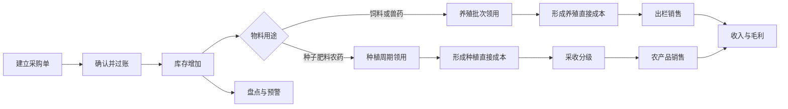

### 7.2 生猪批次流程

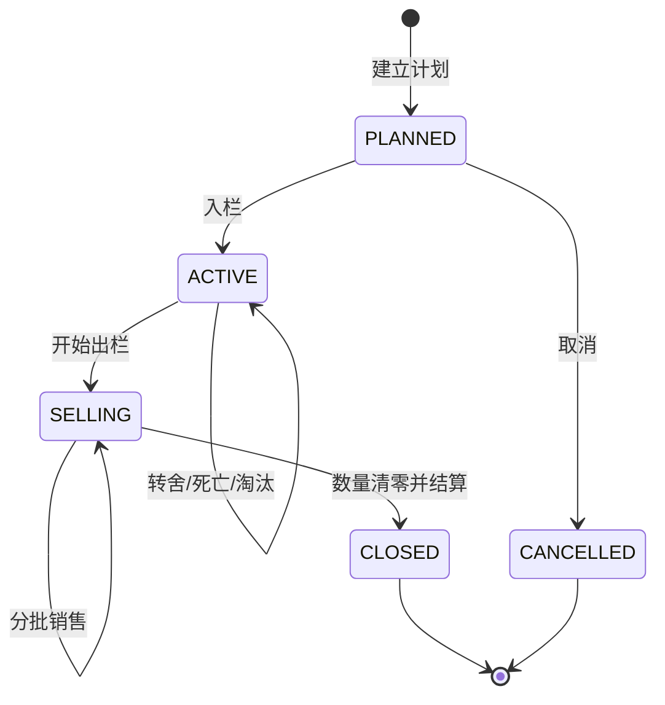

生猪流程规则：

1. 批次存栏由已确认数量流水计算，不能由用户直接修改最终数字。
2. 场内转舍不改变全场存栏，只改变来源和目标圈舍数量。
3. 饲喂和用药确认后产生库存领用及成本；作废时产生反向冲销。
4. 关闭批次前必须检查存栏为零、未处理单据为零，并完成成本结算。

### 7.3 种植周期流程

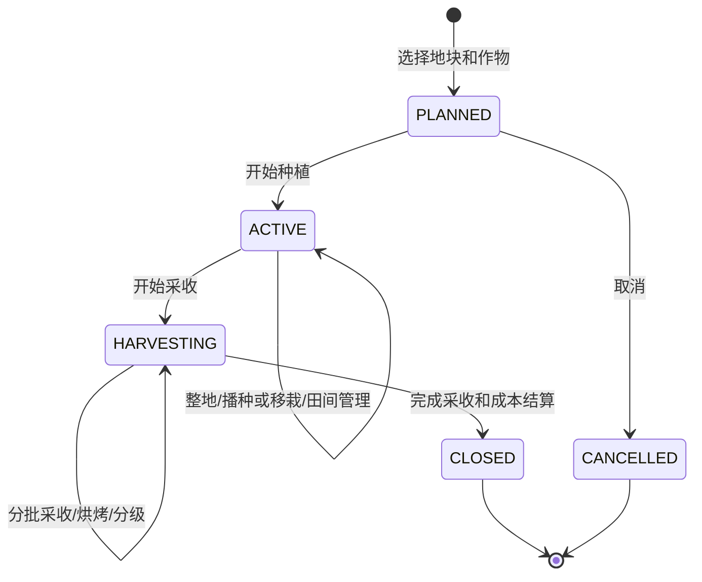

同一地块同一时间原则上只能有一个占用全部面积的活动周期；套种或分区种植必须明确占用面积，所有活动周期面积之和不得超过地块可用面积。

### 7.4 单据状态与库存原则

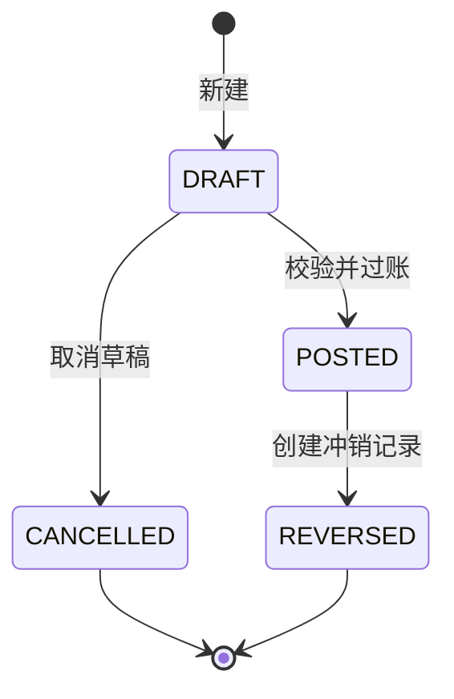

- `DRAFT` 不影响库存、成本和经营指标。
- `POSTED` 才写入正式流水，并锁定影响数量和金额的字段。
- `REVERSED` 保留原单据，同时生成等量反向流水。
- 默认禁止负库存；确有业务需要时只能由管理员按农场配置开启并记录审计。

## 8. 技术选型及优缺点

### 8.1 最终建议技术栈

| 层次 | 技术 | 主要用途 |
|---|---|---|
| 前端语言 | HTML5、CSS3、TypeScript | 页面结构、样式和具备类型约束的交互逻辑 |
| 前端框架 | Vue 3 | 组件化页面和响应式数据管理 |
| 构建工具 | Vite | 本地开发、依赖打包和生产构建 |
| UI 组件 | Element Plus | 表格、表单、菜单、分页、弹窗和反馈组件 |
| 数据可视化 | Apache ECharts | 经营、养殖、种植、库存和财务图表 |
| 路由与状态 | Vue Router、Pinia | 页面路由、登录用户和共享状态 |
| HTTP 客户端 | Axios | API 请求、统一错误和会话失效处理 |
| 后端语言与框架 | Python、Flask 3 | REST API、认证和业务编排 |
| 数据模型 | SQLAlchemy 2 | 模型映射、查询和事务控制 |
| 数据迁移 | Alembic / Flask-Migrate | 数据库结构版本管理 |
| 参数校验 | Pydantic 2 | 请求 DTO、字段校验和类型转换 |
| 数据库 | MySQL 9、PyMySQL | 事务数据、约束、索引和 Python 驱动 |
| Web 服务 | Nginx、Waitress | 静态资源、反向代理和 Windows WSGI 服务 |
| 后端测试 | pytest | 单元、接口、MySQL 集成和覆盖率测试 |
| 前端测试 | Vitest、Vue Test Utils | 组件、状态和工具函数测试 |
| 端到端测试 | Playwright | 通过 Nginx 驱动真实浏览器业务流程 |
| 代码质量 | Ruff、ESLint、Prettier、TypeScript | 格式、静态检查和类型检查 |

### 8.2 技术优缺点与控制措施

| 技术 | 优点 | 缺点或风险 | 本项目控制措施 |
|---|---|---|---|
| Vue 3 | 组件生态成熟、学习资料多、组合式 API 适合业务模块 | 从当前原生 JS 迁移有一次性成本 | 在业务模块开发前完成迁移，先确保认证功能等价 |
| TypeScript | 提前发现字段、接口和空值错误，重构更可靠 | 增加类型编写和构建要求 | 只为真实数据结构定义类型，不建立冗余类型层 |
| Vite | 启动和构建快，配置较少 | 开发环境与 Nginx 生产环境不同 | 每阶段同时执行 Vite 测试和 Nginx 构建验收 |
| Element Plus | Vue 3 生态成熟，复杂表格和表单开发效率高 | 默认外观容易同质化，升级可能有破坏性变更 | 锁定版本、封装业务组件、使用统一设计变量 |
| ECharts | 图表类型丰富、中文资料多、交互和大数据展示能力强 | 配置复杂，错误使用会产生无意义图表 | 建立统一图表容器、指标口径和图表选择规范 |
| Pinia | 官方推荐、结构简单、调试方便 | 滥用会把页面临时状态变成全局状态 | 只存用户、权限、当前农场和共享字典 |
| Axios | 拦截器、超时、取消和错误处理成熟 | 相比原生 `fetch` 增加一个依赖 | 只建立一个请求实例，不重复封装多层客户端 |
| Flask | 轻量、灵活、适合模块化 API | 缺少强制工程结构，大项目易变成单文件 | 使用应用工厂、Blueprint 和模块内分层 |
| SQLAlchemy 2 | 事务、关系和查询能力成熟，适合几十张业务表 | ORM 有学习成本，复杂统计仍需理解 SQL | 普通业务用 ORM，复杂分析允许 SQLAlchemy Core 或参数化 SQL |
| Alembic | 可追踪数据库变更，适合持续开发 | 错误迁移可能破坏数据 | 管理员账号执行、迁移前备份、空库和升级库双测试 |
| Pydantic 2 | 校验规则清楚，前后端字段契约明确 | 与 ORM 模型存在少量字段重复 | 只定义 API 输入输出 DTO，不复制业务行为 |
| MySQL | 成熟稳定、事务和工具生态完善，本机已安装 | 汇总查询随数据增长可能变慢 | 正确索引，达到阈值后增加日/月汇总表 |
| Nginx | 静态资源和反向代理稳定，可统一同源访问 | Windows 版管理体验不如 Linux 服务 | 保留启停脚本、配置检测、PID 和日志检查 |
| Waitress | 原生支持 Windows，部署简单 | 极高并发能力不是目标 | 面向本机或局域网使用足够，公网 Linux 可换 Gunicorn |
| pytest | Fixture 和参数化适合复杂业务规则 | 测试环境管理需要规范 | 使用独立测试库、固定种子数据和统一测试脚本 |
| Playwright | 能验证真实浏览器、响应式和完整流程 | 执行时间比单元测试长 | 冒烟用例每次运行，全量用例阶段验收运行 |

### 8.3 Element UI 与 Element Plus 的决定

[Element UI](https://element.eleme.cn/#/zh-CN) 面向 Vue 2。由于 Vue 2 已不适合作为长期扩展项目的新基础，V1 将采用同一设计体系的 [Element Plus](https://element-plus.org/zh-CN/)，并配合 Vue 3。图表直接使用 [Apache ECharts](https://echarts.apache.org/zh/index.html)。

项目不采用 CDN 临时引入方式，而通过 `package.json` 和锁文件固定依赖版本，再由 Vite 构建生产静态资源，以保证不同机器和不同时间构建结果一致。

### 8.4 Cookie Session 与 JWT 的决定

浏览器通过同一个 Nginx 域名访问页面和 API，V1 继续使用由 Flask 签名、存放在浏览器 Cookie 中的 Session：

- 优点：现有登录逻辑可以平稳迁移；退出和会话失效清晰；浏览器无需保存令牌。
- 风险：写接口需要 CSRF 防护；公网部署必须启用 HTTPS 和 `Secure` Cookie。
- JWT 只有在未来需要原生 App、第三方开放 API 或跨域服务时再引入。

### 8.5 SQLAlchemy 迁移决定

当前只有 `users` 一张正式业务表，此时引入 SQLAlchemy 和 Alembic 的成本最低。迁移过程中必须映射现有字段和主键，不重建、不清空、不修改已有密码哈希。PyMySQL 继续作为底层驱动，受限应用账号权限保持不变。

## 9. 系统总体架构

### 9.1 逻辑架构

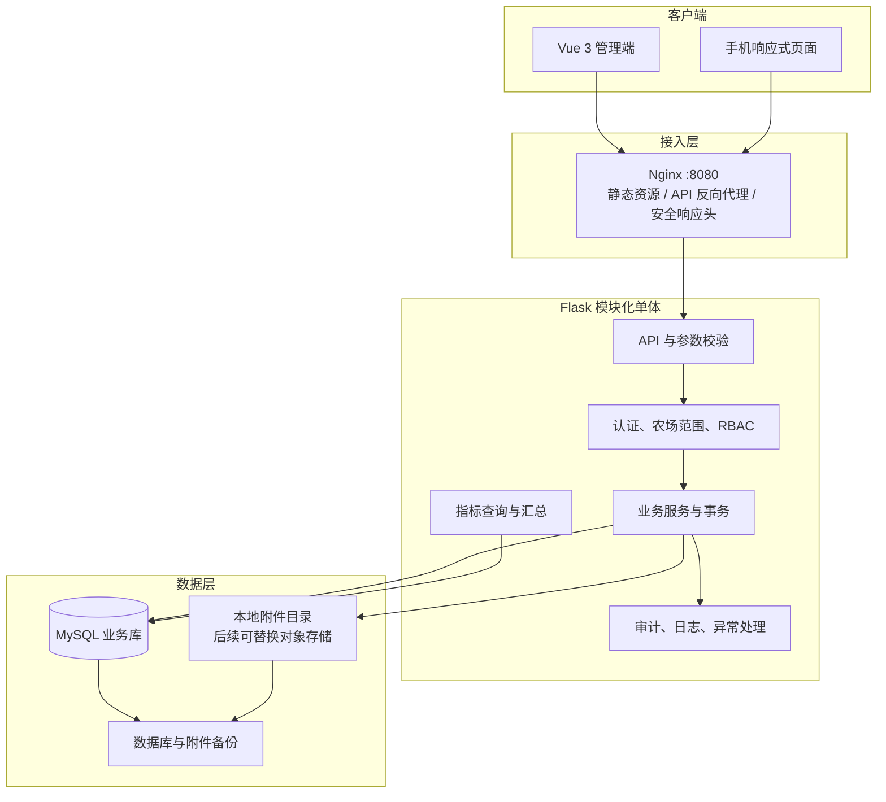

### 9.2 前端分层

| 层次 | 职责 | 禁止事项 |
|---|---|---|
| `views` | 路由页面、组合业务组件、触发用例 | 不直接拼接 URL，不编写数据库口径 |
| `modules/*/components` | 当前业务模块专用表格、表单、详情和图表 | 不跨模块复制相同公共组件 |
| `components` | 通用数据表格、查询栏、状态标签、图表容器、空状态 | 不包含某一品类的业务规则 |
| `stores` | 用户、权限、当前农场、共享字典 | 不保存所有页面临时表单数据 |
| `api` | Axios 实例、接口函数、请求和响应类型 | 不弹业务提示，不操作页面元素 |
| `utils` | 日期、金额、单位、下载等纯函数 | 不访问 Pinia 和页面状态 |

前端数据流固定为：页面操作 → 模块 API → Nginx → Flask → 返回结构化数据 → Store 或页面状态 → Element Plus 与 ECharts 渲染。

### 9.3 后端分层

| 层次 | 职责 | 例子 |
|---|---|---|
| Route / Controller | HTTP 路由、解析参数、调用服务、状态码 | `POST /api/v1/livestock-batches` |
| Schema / DTO | 类型、必填、范围、格式和枚举校验 | 数量必须大于 0，日期不能为空 |
| Service | 业务规则、权限、事务边界、跨表协作 | 饲料领用同时写库存和批次成本 |
| Model | 数据表映射、关系和基础约束 | `LivestockBatch`、`StockDocument` |
| Repository / Query | 复杂可复用查询、锁和分析 SQL | 库存余额、批次利润、趋势聚合 |
| Infrastructure | 数据库、日志、文件、任务、配置 | SQLAlchemy Session、附件存储 |

简单单表查询可以由 Service 直接使用 Model，只有复杂复用查询才建立 Repository，避免为每张表制造没有业务价值的样板代码。

### 9.4 API 请求生命周期

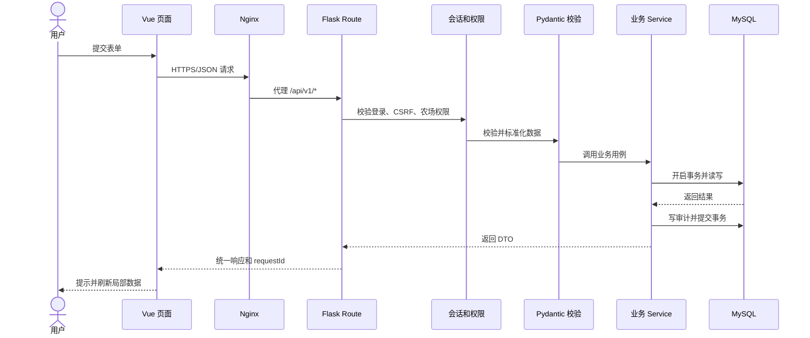

### 9.5 部署架构

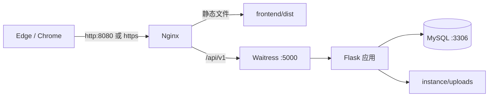

开发时 Vite 可以单独提供热更新并代理 API；每个阶段的集成验收必须使用生产构建后的 `dist`、Waitress 和 Nginx，不以 Vite 开发服务器的结果代替发布验收。

## 10. 项目结构设计

### 10.1 当前结构

```text
D:\zongheguanlixitong\
├─ backend\
│  ├─ app.py
│  └─ instance\              # 密钥、MySQL 本机配置、历史备份
├─ frontend\
│  ├─ index.html
│  ├─ css\style.css
│  ├─ js\app.js
│  └─ assets\
├─ nginx\
│  ├─ nginx.exe
│  ├─ conf\nginx.conf
│  └─ logs\
├─ tests\test_auth.py
├─ requirements.txt
├─ start.ps1
├─ stop.ps1
└─ README.md
```

### 10.2 V1 目标结构

```text
D:\zongheguanlixitong\
├─ backend\
│  ├─ __init__.py
│  ├─ app\
│  │  ├─ __init__.py                 # 应用工厂
│  │  ├─ config.py                   # 环境配置
│  │  ├─ extensions.py               # SQLAlchemy、迁移、CSRF
│  │  ├─ core\                       # 权限、错误、日志、审计、通用类型
│  │  └─ modules\
│  │     ├─ auth\
│  │     ├─ farm\
│  │     ├─ inventory\
│  │     ├─ livestock\
│  │     ├─ crop\
│  │     ├─ trade\
│  │     ├─ analytics\
│  │     └─ system\
│  ├─ migrations\                    # Alembic 迁移脚本
│  ├─ instance\                      # 不进入版本库的密钥、配置、上传文件
│  ├─ wsgi.py                         # Waitress 入口
│  └─ requirements.txt
├─ frontend\
│  ├─ src\
│  │  ├─ api\
│  │  ├─ assets\
│  │  ├─ components\
│  │  ├─ layouts\
│  │  ├─ modules\
│  │  ├─ router\
│  │  ├─ stores\
│  │  ├─ styles\
│  │  ├─ utils\
│  │  └─ main.ts
│  ├─ public\
│  ├─ dist\                          # 构建输出，不手工修改
│  ├─ package.json
│  ├─ package-lock.json
│  ├─ tsconfig.json
│  └─ vite.config.ts
├─ tests\
│  ├─ backend\unit\
│  ├─ backend\integration\
│  ├─ frontend\
│  ├─ e2e\
│  └─ fixtures\
├─ scripts\                           # 测试、备份、恢复、初始化脚本
├─ docs\
├─ nginx\
├─ logs\                              # 运行日志，不进入版本库
├─ start.ps1
├─ stop.ps1
├─ .env.example                       # 仅示例，不含密码
├─ .gitignore
└─ README.md
```

模块目录和文件只在对应阶段开始时创建，不提前生成大量空文件。

### 10.3 从当前结构迁移的保护措施

1. 先为当前代码和 MySQL 建立可恢复备份。
2. 使用 SQLAlchemy 模型映射现有 `users` 表，先通过只读校验，再运行认证回归。
3. 新 Vue 登录页与旧登录页并存到功能等价，不直接删除旧前端。
4. 前端构建成功后将 Nginx 根目录从 `frontend` 调整为 `frontend/dist`。
5. 全部认证 E2E 通过后再移除旧页面，并在变更记录中注明。
6. 生产应用账号不执行 DDL；迁移由管理员账号单独执行。
7. 迁移前确认现有 `created_at`、`last_login_at` 的实际时区含义，不能因为旧接口曾追加 `Z` 就盲目转换历史时间。

## 11. 页面与交互设计

### 11.1 设计定位

系统属于需要每天重复使用的生产管理工具，界面应安静、清晰、紧凑、易扫描。避免营销式大标题、过多装饰卡片和只有视觉效果但没有决策价值的图表。

| 项目 | V1 规范 |
|---|---|
| 设计基准 | 桌面端 1440×900，兼容 1024 宽度；手机端重点验证 375×812 和 390×844 |
| 主色 | 农业绿色，用于主操作和选中状态，不覆盖所有图表颜色 |
| 中性色 | 白、浅灰、深灰用于背景、边界和文字层级 |
| 状态色 | 成功绿色、提醒琥珀色、危险红色、信息蓝色，文字不能只依赖颜色表达 |
| 图表色 | 使用可区分的多色序列，同一指标在不同页面保持同色 |
| 圆角 | 表格和工具区尽量无卡片化；必要卡片不超过 8px |
| 字体 | 系统中文字体，正文 14px 左右，紧凑面板不使用超大标题 |
| 数字 | 数量、金额右对齐，显示千位分隔符和单位，金额保留两位小数 |
| 图标 | 使用 Element Plus Icons；不手绘已有通用图标 |
| 反馈 | 所有保存、过账、作废、导出均有加载、成功或错误反馈 |

### 11.2 全局页面框架

```text
+----------------------+------------------------------------------------------+
| 品牌 / 当前农场      | 顶栏：面包屑            搜索  提醒  用户菜单          |
|----------------------|------------------------------------------------------|
| 工作台               | 页面标题                              主要操作按钮     |
| 基础资料             |------------------------------------------------------|
| 库存采购             | 筛选区：日期 / 状态 / 批次 / 关键字                  |
| 养殖管理             |------------------------------------------------------|
| 种植管理             | KPI、图表、表格或详情内容                             |
| 销售经营             |                                                      |
| 数据分析             |                                                      |
| 系统管理             |                                                      |
+----------------------+------------------------------------------------------+
```

- 桌面端使用固定侧边导航和顶部工具栏。
- 小屏使用抽屉导航，主要操作固定在易触达位置，表格允许横向滚动或切换精简列。
- 当前农场必须始终可见；切换农场后刷新业务数据并清空不兼容的筛选条件。
- 面包屑表达当前位置，返回列表时保留原搜索和分页状态。

### 11.3 信息架构与路由

| 一级模块 | 页面 | 建议路由 | 主要权限 |
|---|---|---|---|
| 认证 | 登录、首次初始化 | `/login`、`/setup` | 匿名或未初始化 |
| 工作台 | 综合经营总览 | `/dashboard` | 全部已登录用户 |
| 基础资料 | 农场、圈舍、地块、仓库 | `/base/farms`、`/base/barns`、`/base/plots`、`/base/warehouses` | 管理员、负责人 |
| 基础资料 | 物料、单位、养殖和作物字典 | `/base/items`、`/base/catalogs` | 管理员、负责人 |
| 库存采购 | 采购单、库存现状、库存流水、仓库调拨、生产领退料、盘点 | `/inventory/purchases`、`/inventory/stocks`（含调拨、领退料、流水与盘点） | 负责人、操作员；查看员只读 |
| 养殖管理 | 生猪批次列表、详情、入栏和存栏变动 | `/livestock/pigs` | 负责人、操作员；查看员只读 |
| 种植管理 | 种植周期、周期详情、农事快速记录 | `/crops/cycles`、`/crops/cycles/:id`、`/crops/daily-entry` | 负责人、种植员 |
| 销售经营 | 客户、销售单、收付款、成本 | `/trade/customers`、`/trade/sales`、`/finance/payments`、`/finance/costs` | 负责人、财务 |
| 数据分析 | 综合、养殖、种植、库存、利润分析 | `/analytics/overview`、`/analytics/livestock`、`/analytics/crops`、`/analytics/inventory`、`/analytics/profit` | 按数据范围查看 |
| 任务中心 | 待办、提醒和完成记录 | `/tasks` | 全部已登录用户 |
| 系统管理 | 用户、权限、审计、备份和系统状态 | `/system/users`、`/system/audit`、`/system/operations` | 管理员 |

### 11.4 标准列表页面

所有业务列表遵循统一结构：

1. 标题区显示页面名称、数据范围和主要新增按钮。
2. 筛选区包含关键词、状态、日期和业务特有条件；支持重置。
3. 工具区提供刷新、列设置和导出；批量操作只有选中记录后才可用。
4. 表格显示业务编号、关键内容、状态、时间和操作，金额与数量右对齐。
5. 默认后端分页，URL 保存可分享的筛选参数。
6. 无数据时说明当前结果为空并提供合理操作；接口错误时提供重试。

### 11.5 标准详情页面

生产批次和种植周期采用“概况 + 标签页”结构：

- 概况：编号、状态、农场、圈舍或地块、开始日期、当前数量或面积、负责人。
- 生产记录：按时间倒序展示所有业务事件。
- 投入与库存：饲料、兽药、种子、肥料、农药等消耗及来源单据。
- 健康或农事：领域专用记录。
- 产出与销售：出栏、采收、等级、销售及退货。
- 成本分析：直接成本、分摊成本、单位成本、收入和利润。
- 附件与审计：图片、凭证、修改和过账历史。

### 11.6 关键业务页面设计

| 页面 | 核心区域 | 关键交互 |
|---|---|---|
| 综合工作台 | KPI、今日任务、库存预警、生产异常、收支趋势 | 点击指标进入带相同筛选条件的明细 |
| 库存现状 | 仓库与分类筛选、余额表、低库存和临期标识 | 点击数量查看完整流水 |
| 采购单 | 供应商、日期、明细行、总额、附件、状态 | 草稿可改，过账后二次确认并锁定 |
| 猪批次详情 | 存栏、日龄、均重、死亡率、料肉比、成本、事件时间线 | 快速新增饲喂、健康、称重和数量事件 |
| 种植周期详情 | 地块、面积、阶段、投入、农事、采收和亩指标 | 从作业记录领用多个投入品 |
| 销售单 | 客户、产品或出栏批次、数量、单价、应收和收款 | 过账同步出库与收入，退货走反向单据 |
| 分析页面 | 全局筛选、KPI、趋势、对比、结构和明细 | 图表联动、下钻、导出，保留指标说明 |

### 11.7 表单设计

- 必填字段在标签和校验消息中明确表达，不只显示红色边框。
- 数量输入必须同时显示单位；金额输入限制小数位但保存前仍由后端校验。
- 日期使用日期选择器，生产发生日期和系统创建时间分开保存。
- 批次、地块、仓库和物料选择支持搜索，只展示当前农场有效数据。
- 长表单按“基本信息、明细、备注和附件”分组，不使用卡片嵌套卡片。
- 离开未保存表单时提示；提交中禁用重复提交。
- 过账前展示影响摘要，例如“将扣减饲料 120 kg，并计入批次成本 360 元”。

### 11.8 响应式与无障碍

- 所有图标按钮具备可读的 `aria-label` 或 Tooltip。
- 表单标签与输入控件正确关联，键盘可以完成主要操作。
- 正文和关键状态满足合理对比度，颜色之外增加图标或文字。
- ECharts 提供标题、单位、空数据说明和可访问描述。
- 移动端隐藏次要表格列，不能通过压缩文字造成溢出。
- Playwright 对桌面和手机视口执行截图及重叠检查。

## 12. 后端设计

### 12.1 业务模块职责

| 模块 | 职责 | 不负责 |
|---|---|---|
| `auth` | 用户、会话、密码、当前用户、农场成员身份 | 具体业务数据授权规则 |
| `farm` | 农场、成员关系、圈舍和地块 | 库存余额和生产事件 |
| `catalog` | 单位、养殖品类、作物类型和作物品种 | 农场级物料和库存 |
| `inventory` | 仓库、物料分类、物料、采购、库存单据、库存流水、盘点和预警 | 销售收入和生产指标 |
| `livestock` | 批次、数量变化、饲喂、健康和称重 | 通用物料主数据 |
| `crop` | 种植周期、农事、投入、采收、分级和烟草烘烤 | 通用采购和销售 |
| `trade` | 客户、销售、收付款、其他成本和经营结算 | 生产过程明细 |
| `analytics` | 指标口径、聚合查询、趋势、对比和导出 | 修改业务来源数据 |
| `system` | 任务、附件、审计、配置、健康和运维 | 领域业务规则 |

### 12.2 REST API 约定

- 正式接口统一使用 `/api/v1` 前缀；健康检查保留 `/api/health`。
- 资源使用复数名词，使用 HTTP 方法表达查询、新增、修改和状态操作。
- 列表接口统一支持 `page`、`pageSize`、`sort`、`keyword` 和模块筛选条件。
- 日期使用 ISO 8601；纯业务日期使用 `YYYY-MM-DD`，时间戳以 UTC 传输并在界面转为 `Asia/Shanghai`。
- 金额和高精度数量在 JSON 中使用字符串，避免 JavaScript 浮点误差。
- API 不直接返回 ECharts `option`，而返回有业务含义的指标和序列，前端负责视觉配置。

成功响应示例：

```json
{
  "success": true,
  "data": {
    "id": 1201,
    "batchCode": "PIG-2026-001",
    "status": "ACTIVE"
  },
  "message": "保存成功",
  "requestId": "req_01"
}
```

分页响应示例：

```json
{
  "success": true,
  "data": {
    "items": [],
    "page": 1,
    "pageSize": 20,
    "total": 0
  },
  "requestId": "req_02"
}
```

错误响应示例：

```json
{
  "success": false,
  "code": "INVENTORY_INSUFFICIENT",
  "message": "饲料库存不足",
  "field": "quantity",
  "details": { "available": "80.000", "requested": "120.000", "unit": "kg" },
  "requestId": "req_03"
}
```

### 12.3 HTTP 状态与业务错误

| HTTP 状态 | 使用场景 |
|---|---|
| 200 | 查询、修改、状态操作成功 |
| 201 | 资源创建成功 |
| 204 | 无响应体的成功操作 |
| 400 | JSON 格式、分页参数等请求格式错误 |
| 401 | 未登录或会话失效 |
| 403 | 已登录但无当前农场或操作权限 |
| 404 | 数据不存在或不在用户可见范围内 |
| 409 | 唯一冲突、状态冲突、重复过账或库存并发冲突 |
| 422 | 字段格式正确但违反业务校验规则 |
| 500 | 未预期服务器错误，响应不暴露堆栈和数据库信息 |

业务错误码采用大写英文常量，例如 `BATCH_ALREADY_CLOSED`、`PLOT_AREA_EXCEEDED`、`DOCUMENT_ALREADY_POSTED`。前端根据错误码定位交互，但最终提示文字由后端提供。

### 12.4 核心 API 分组

| 分组 | 示例接口 |
|---|---|
| 认证 | `POST /auth/login`、`POST /auth/logout`、`GET /auth/me` |
| 农场 | `GET/POST /farms`、`GET/POST /farms/{id}/members` |
| 基础资料 | `/barns`、`/plots`、`/warehouses`、`/items`、`/catalogs` |
| 采购库存 | `/purchases`、`/stock-documents`、`/stocks`、`/stock-ledger`、`/stock-transfers`、`/production-stock-operations`、`/inventory-counts`、`/inventory-analysis` |
| 养殖 | `/livestock-batches`、`/livestock-batches/{id}`、`/livestock-movements`；后续 `/feeding-records`、`/health-records`、`/weight-records` |
| 种植 | `/crop-cycles`、`/field-operations`、`/harvest-batches`、`/grading-records`、`/tobacco-curing-batches` |
| 销售经营 | `/customers`、`/sales`、`/payments`、`/cost-entries` |
| 分析 | `/analytics/overview`、`/analytics/livestock`、`/analytics/crops`、`/analytics/inventory`、`/analytics/profit` |
| 系统 | `/tasks`、`/attachments`、`/audit-logs`、`/system/health` |

以上路径均位于 `/api/v1` 下，表中省略共同前缀。

### 12.5 事务与并发

Service 是事务边界。一次“过账”涉及的业务单据、库存流水、成本记录和审计日志必须在同一数据库事务中成功或全部回滚。

关键规则：

1. 过账接口必须幂等。相同单据重复提交不能重复扣减库存。
2. 库存扣减时锁定相关仓库和物料余额查询，事务内重新校验可用数量。
3. 单据更新携带版本号或最近更新时间，发现并发修改时返回 409。
4. 统计查询不能改变业务数据。
5. 外部文件写入失败时不得提交只引用了不存在附件的业务记录。

### 12.6 认证、授权与安全

- 首次部署允许创建第一个管理员；完成初始化后关闭公开注册，由管理员创建或邀请用户。
- 登录账号不区分大小写，密码长度 8 至 64 位且至少包含字母和数字；后续可提高策略但不得降低。
- Cookie 设置 `HttpOnly`、`SameSite=Lax`；启用 HTTPS 后设置 `Secure`。
- 所有修改类 API 校验 CSRF Token。
- Nginx 对登录接口设置合理频率限制，连续失败写入安全日志。
- 每条业务查询必须包含当前用户允许访问的 `farm_id` 范围，不能只依赖前端传入的农场 ID。
- 所有 SQL 通过 SQLAlchemy 参数绑定或参数化 SQL，禁止字符串拼接用户输入。
- 上传文件校验大小、扩展名、MIME 和实际文件类型，使用随机存储名并禁止脚本执行。
- 密钥和数据库密码只放在环境变量或 `backend/instance`，不得进入 Git、日志、API 或文档。
- 公网部署前必须配置 HTTPS、可信证书、数据库访问范围和主机防火墙。

### 12.7 角色权限矩阵

| 能力 | 管理员 | 负责人 | 操作员 | 查看人员 |
|---|:---:|:---:|:---:|:---:|
| 用户与农场授权 | 是 | 否 | 否 | 否 |
| 基础资料维护 | 是 | 是 | 受限 | 否 |
| 新建生产记录 | 是 | 是 | 是 | 否 |
| 修改本人草稿 | 是 | 是 | 是 | 否 |
| 过账库存和销售 | 是 | 是 | 按授权 | 否 |
| 作废或冲销 | 是 | 是 | 否 | 否 |
| 查看成本和利润 | 是 | 是 | 按授权 | 是 |
| 导出数据 | 是 | 是 | 按授权 | 按授权 |
| 查看审计日志 | 是 | 按授权 | 否 | 否 |
| 备份和系统配置 | 是 | 否 | 否 | 否 |

角色是权限集合，后端最终根据权限代码判断。V1 先提供四个内置角色，不在第一阶段开发任意拖拽式权限设计器。

### 12.8 日志、审计和可观测性

- 每个请求生成 `requestId`，响应、应用日志和错误日志使用同一编号。
- 应用日志记录时间、级别、模块、请求、用户、农场、耗时和错误类型，但不记录密码、Cookie 和敏感配置。
- 审计日志记录新增、修改、过账、冲销、登录失败、权限变更和导出。
- 健康检查分为进程健康和数据库健康；未来可增加磁盘空间、备份时间检查。
- 慢查询达到 500ms 时写入慢查询日志并记录模块和筛选条件。

### 12.9 后台任务

V1 需要的日汇总、到期提醒和备份通过 Flask CLI 命令实现，再由 Windows 任务计划程序单实例调度。例如：

```powershell
python -m flask --app wsgi analytics aggregate --date 2026-08-13
python -m flask --app wsgi reminders generate
python -m flask --app wsgi backup create
```

这些是目标命令，需在对应阶段实现后才能使用。任务必须支持重复执行而不产生重复汇总或提醒；执行结果写日志并返回非零失败码。

## 13. 数据库设计

### 13.1 数据库设计原则

| 项目 | 规范 |
|---|---|
| 数据库 | 继续使用 `agriculture_management`，测试使用独立的 `agriculture_management_test` |
| 引擎与字符集 | InnoDB、`utf8mb4`，使用支持中文和大小写规则明确的排序规则 |
| 主键 | 新业务表统一使用 `BIGINT UNSIGNED AUTO_INCREMENT` |
| 农场隔离 | 业务表必须包含 `farm_id`，查询由服务端强制限定访问范围 |
| 数量 | `DECIMAL(14,3)`，禁止使用 FLOAT 保存库存、重量或面积 |
| 金额 | `DECIMAL(14,2)`，默认币种 CNY |
| 比率 | 数据库存原始分子和分母，展示时计算；确需保存时使用 `DECIMAL` |
| 时间 | 业务日期用 `DATE`；系统时间用 UTC `DATETIME(6)`，前端按上海时区显示 |
| 状态 | 使用稳定英文代码的 `VARCHAR`，由数据库约束和后端枚举共同校验 |
| 审计字段 | 主数据和业务单据包含 `created_at`、`created_by`、`updated_at`、`updated_by` |
| 删除 | 主数据停用使用 `is_active`；已过账交易使用作废或冲销，不物理删除 |
| 唯一编号 | 编号在农场范围唯一，例如 `UNIQUE(farm_id, batch_no)` |
| 外键 | 核心关系使用外键，历史数据默认 `RESTRICT`，避免级联误删 |
| 迁移 | Alembic 管理，管理员账号执行，应用账号不具有 DDL 权限 |

### 13.2 总体实体关系

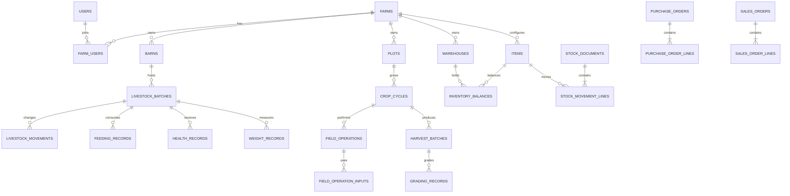

### 13.3 系统、组织和基础资料表

所有表默认包含 `id`；需要审计的表默认包含创建和更新时间字段，表中不重复列出这些公共字段。

| 表名 | 关键字段 | 主要约束与用途 | 阶段 |
|---|---|---|---|
| `users` | `username`、`display_name`、`password_hash`、`is_active` | 保留现有 ID 和密码哈希；账号全局唯一 | 已有，阶段 1 扩展 |
| `farms` | `code`、`name`、`owner_name`、`address`、`timezone`、`is_active` | 农场编号唯一；V1 默认时区 `Asia/Shanghai` | 2 |
| `farm_users` | `farm_id`、`user_id`、`role_code`、`is_active` | `(farm_id,user_id)` 唯一；角色从全局迁移到农场范围 | 2 |
| `farm_settings` | `farm_id`、`setting_key`、`setting_value` | `(farm_id,setting_key)` 唯一；只保存确需配置的业务项 | 2 |
| `units` | `code`、`name`、`dimension`、`base_factor`、`scale` | 单位代码唯一；支持 kg、斤、头、只、亩等 | 2 |
| `livestock_species` | `code`、`name`、`tracking_mode`、`is_active` | 初始猪、鸡；`tracking_mode` V1 为 `BATCH` | 2 |
| `crop_types` | `code`、`name`、`is_active` | 初始烟草、大蒜、水稻、油菜 | 2 |
| `crop_varieties` | `crop_type_id`、`code`、`name`、`is_active` | 作物内品种编号唯一 | 2 |
| `barns` | `farm_id`、`code`、`name`、`barn_type`、`capacity`、`is_active` | 农场内编号唯一；容量非负 | 2 |
| `plots` | `farm_id`、`code`、`name`、`area_mu`、`soil_type`、`is_active` | 农场内编号唯一；面积大于 0 | 2 |
| `warehouses` | `farm_id`、`code`、`name`、`location`、`is_active` | 农场内编号唯一 | 2 |
| `item_categories` | `farm_id`、`parent_id`、`code`、`name` | 饲料、兽药、种子、肥料、农药、产品等分类 | 2 |
| `items` | `farm_id`、`category_id`、`code`、`name`、`unit_id`、`item_type`、`safety_stock`、`lot_tracking` | 农场内物料编号唯一；安全库存非负 | 2 |
| `suppliers` | `farm_id`、`code`、`name`、`contact`、`phone`、`is_active` | 农场内供应商编号唯一 | 3 |
| `customers` | `farm_id`、`code`、`name`、`contact`、`phone`、`is_active` | 农场内客户编号唯一 | 7 |
| `tasks` | `farm_id`、`title`、`task_type`、`due_at`、`assignee_id`、`status`、`source_type`、`source_id` | 任务可手工创建或由业务规则生成 | 8 |
| `attachments` | `farm_id`、`business_type`、`business_id`、`original_name`、`storage_key`、`mime_type`、`size_bytes` | 文件随机存储；数据库不保存大文件正文 | 8 |
| `audit_logs` | `farm_id`、`user_id`、`action`、`entity_type`、`entity_id`、`before_json`、`after_json`、`request_id` | 追加写入；不允许普通业务用户修改 | 1 |
| `alembic_version` | `version_num` | Alembic 自动维护当前数据库迁移版本 | 1 |

### 13.4 采购与库存表

| 表名 | 关键字段 | 主要约束与用途 | 阶段 |
|---|---|---|---|
| `purchase_orders` | `farm_id`、`order_no`、`supplier_id`、`order_date`、`status`、`total_amount`、`posted_at` | 农场内单号唯一；只有过账才影响库存 | 3 |
| `purchase_order_lines` | `purchase_order_id`、`item_id`、`quantity`、`unit_price`、`amount`、`lot_no`、`expires_on` | 数量大于 0；金额按统一规则舍入 | 3 |
| `stock_documents` | `farm_id`、`document_no`、`document_type`、`from_warehouse_id`、`to_warehouse_id`、`status`、`source_type`、`source_id`、`occurred_at` | 入库、领用、退库、调拨、盘点、冲销统一单据头；来源字段为普通联合索引，允许同一来源发生多次部分退货 | 3 |
| `stock_movement_lines` | `stock_document_id`、`warehouse_id`、`item_id`、`quantity_delta`、`unit_cost`、`lot_no`、`expires_on`、`cost_object_type`、`cost_object_id` | 已过账流水不可改；正数入库、负数出库 | 3 |
| `inventory_balances` | `farm_id`、`warehouse_id`、`item_id`、`quantity`、`average_cost`、`updated_at` | `(warehouse_id,item_id)` 唯一；事务内锁定并更新的余额缓存 | 3 |
| `inventory_counts` | `farm_id`、`count_no`、`warehouse_id`、`count_date`、`status`、`version`、`posted_at` | 农场内盘点单号唯一；草稿、已过账、已取消三态；版本控制并发修改 | 3 |
| `inventory_count_lines` | `inventory_count_id`、`item_id`、`lot_no`、`expires_on`、`book_quantity`、`actual_quantity`、`difference_quantity`、`unit_cost`、`reason` | 按物料批号保留账面快照；差异由系统计算；非零差异必须填写原因 | 3 |

库存真实依据是已过账的 `stock_movement_lines`，`inventory_balances` 用于高效读取和并发锁。每晚或每次阶段验收必须执行“余额表对流水汇总”的一致性检查，发现不一致立即阻止发布。

截至 2026-08-16，`0006_inventory_purchase` 实际落地采购与库存主表；`0007_inventory_operations` 允许人工调拨和生产领退料复用库存账；`0008_purchase_returns` 支持同一采购明细多次部分退货；`0009_inventory_counts` 新增盘点单和按批号盘点明细。当前开放采购入库、采购退货、人工仓库调拨、生产领料、生产退料和盘点调整六种过账来源，全部写入同一套 `stock_documents` 和 `stock_movement_lines`。

#### 13.4.1 已实现的仓库调拨事务

每张调拨单当前只处理一个物料和一个批号，确认即过账。服务在同一数据库事务内锁定来源与目标仓余额，来源仓写负流水，目标仓写正流水；目标仓已有库存时按移动平均法合并成本。系统拒绝同仓调拨、跨农场引用、未来日期、总库存不足和指定批号库存不足。同单号同内容重试直接返回既有结果，同单号不同内容返回 `409`，避免网络重试造成重复扣增。

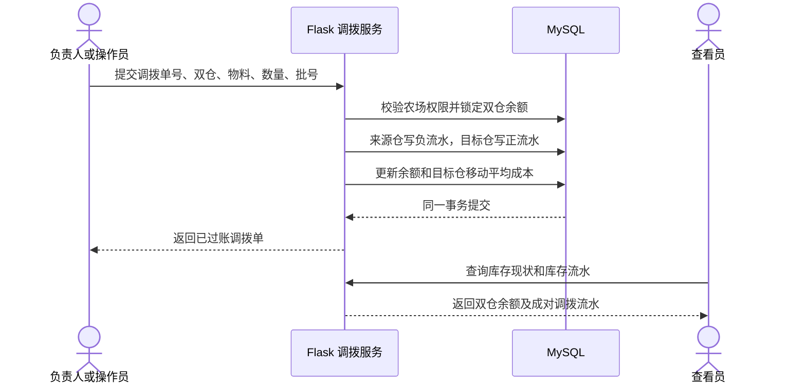

#### 13.4.2 已实现的生产领退料事务

生产领退料直接复用 `stock_documents`、`stock_movement_lines` 和 `inventory_balances`。领料写负流水，退料写正流水；每条流水必须关联农场通用、圈舍或地块之一，后续养殖和种植模块可据此归集物料成本。负责人、操作员和管理员可办理，查看员只能查询。

退料不是普通入库。系统按“同农场、同仓库、同物料、同批号、同成本对象、截至业务日期”的历史领料减历史退料计算可退余额，允许多次部分退料但禁止累计超退。退料单位成本按尚未退回的历史领料加权成本计算，不采用退料时仓库的当前平均价；退回库存再按移动平均法并入仓库余额，保证生产成本和库存价值都可解释。

系统同时拦截未来日期、跨农场对象、停用仓库/物料/圈舍/地块、总库存不足、批号库存不足和越权操作。同单号同内容重复提交返回既有结果，同单号不同内容返回 `409`。本能力仅扩展服务与页面，不新增表或迁移。

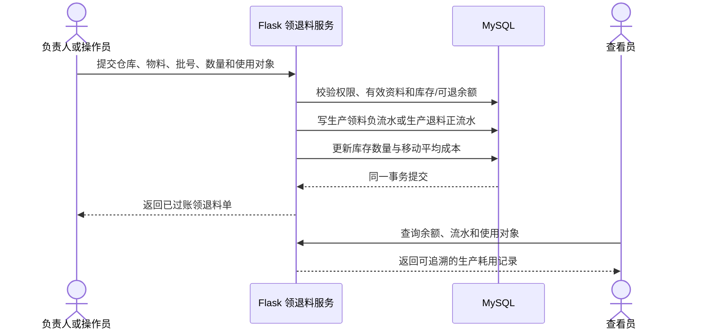

#### 13.4.3 已实现的采购退货事务

采购退货必须关联一条已过账采购明细，可以从当前农场任一启用仓库退回原物料和批号，并允许分多次部分退货。服务按原采购明细汇总历史 `PURCHASE_RETURN` 流水，禁止累计退货数量超过原采购数量；同时校验退货仓库的物料总库存和指定批号库存，任一不足都拒绝整笔事务。

退货日期不得早于原采购日期或晚于当前日期。供应商退款金额按原采购单价计算，库存负流水的单位成本按退货仓库过账时的当前移动平均成本记录，这两个金额口径不能混用：前者表示与供应商结算的业务金额，后者表示本次库存减少的账面成本。当前版本只返回预计退款并保留来源关联，尚未生成应付退款或收付款流水，相关资金结算留到阶段 7。

管理员、负责人和操作员可办理采购退货，查看员只能读取结果。同一退货单号和相同内容重复提交返回原结果，同单号不同内容返回 `409`；未来日期、错误采购明细、跨农场引用、累计超退、总库存不足和批号库存不足均有明确错误码。采购详情同步返回 `returnedQuantity` 和 `returnableQuantity`，前端展示已退与可退数量，库存流水使用 `PURCHASE_RETURN` 类型展示“采购退货”。

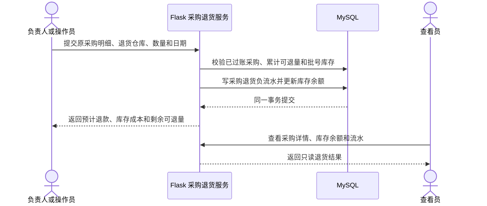

#### 13.4.4 已实现的库存盘点事务

负责人、操作员和管理员可以按仓库生成盘点单。系统在生成时按“物料 + 批号”汇总该仓库所有已过账流水，将数量、有效期和当前移动平均成本保存为不可变账面快照；空仓库、未来日期、重复单号和跨农场仓库会被拒绝。草稿允许录入非负实盘数量和备注，差异由系统计算，任何非零差异都必须填写原因。查看员可查询列表和明细，但不能新建、保存、取消或过账。

过账时服务先锁定盘点单、明细和仓库物料余额，再重新汇总完整仓库批号。如果盘点期间任何批号新增、消失或数量变化，整单返回 `INVENTORY_COUNT_STALE`，要求取消后重新生成，避免将正常出入库误记为盘盈盘亏。校验通过后，正差异写盘盈流水，负差异写盘亏流水，并在同一事务更新余额；无差异盘点仍保留已过账盘点单但不制造零数量流水。重复过账直接返回原结果，已取消盘点不能过账。

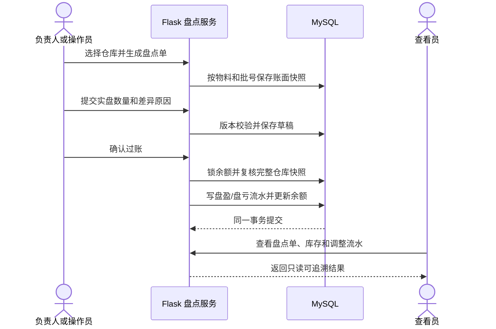

### 13.5 养殖业务表

| 表名 | 关键字段 | 主要约束与用途 | 阶段 |
|---|---|---|---|
| `livestock_batches` | `farm_id`、`species_id`、`batch_no`、`name`、`entry_date`、`source`、`status`、`closed_at`、`notes` | 农场内批次编号唯一；当前开放猪批次；剩余头数归零时自动结束 | 4，已实现 |
| `livestock_movements` | `farm_id`、`batch_id`、`movement_no`、`movement_type`、`occurred_on`、`quantity`、`from_barn_id`、`to_barn_id`、`reason`、`notes` | 农场内流水号唯一；记录 `ENTRY`、`TRANSFER`、`DEATH`、`CULL`、`EXIT`；存栏由流水计算 | 4，已实现 |
| `feeding_records` | `batch_id`、`record_date`、`item_id`、`quantity`、`stock_document_id`、`amount`、`notes` | 领用饲料后关联库存单据；数量和金额大于等于 0 | 4 |
| `health_records` | `batch_id`、`record_date`、`record_type`、`symptom`、`diagnosis`、`item_id`、`dosage`、`stock_document_id`、`withdrawal_end_date` | 防疫、用药、诊疗和消毒；药品可关联库存 | 4 |
| `weight_records` | `batch_id`、`record_date`、`sample_count`、`total_weight`、`average_weight`、`measurement_method` | 样本数和重量大于 0；均重由系统计算 | 4 |

母猪个体表、配种记录、妊娠检查和分娩记录不在默认 V1 建表范围内，避免在生产模式未确认时提前固化错误模型。

#### 13.5.1 已实现的生猪批次与存栏规则

创建批次和首条 `ENTRY` 流水在同一事务内提交；转舍从来源圈舍扣减并向目标圈舍增加，因此不改变农场和批次总存栏；死亡、淘汰和出栏只从来源圈舍扣减。当前存栏等于全部入栏减死亡、淘汰和出栏，圈舍分布则按所有流入减流出计算。系统不保存第二份可人工修改的当前存栏。

负责人、操作员和系统管理员可以登记，查看员只读。服务端在写入时锁定批次和涉及的圈舍，拒绝来源圈舍超量、跨农场圈舍、不兼容圈舍类型、超出设计容量、未来日期和早于最近流水的倒序日期。死亡与淘汰必须填写原因；相同流水号和相同内容重试返回原记录，相同流水号不同内容返回 `409`。批次剩余头数归零后自动转为 `CLOSED`，此后不允许新增流水。


### 13.6 种植业务表

| 表名 | 关键字段 | 主要约束与用途 | 阶段 |
|---|---|---|---|
| `crop_cycles` | `farm_id`、`cycle_code`、`plot_id`、`crop_type_id`、`variety_id`、`area_mu`、`planned_start_date`、`actual_start_date`、`status` | 农场内周期编号唯一；活动面积不能超过地块面积 | 5 |
| `field_operations` | `crop_cycle_id`、`operation_type`、`operation_date`、`area_mu`、`labor_hours`、`machine_hours`、`labor_cost`、`service_cost`、`notes` | 记录整地、播种、移栽、灌溉、施肥、用药等 | 5 |
| `field_operation_inputs` | `field_operation_id`、`item_id`、`quantity`、`stock_document_id`、`amount` | 一次农事可使用多个投入品并关联库存领用 | 5 |
| `harvest_batches` | `crop_cycle_id`、`harvest_no`、`harvest_date`、`gross_weight`、`net_weight`、`unit_id`、`warehouse_id` | 周期内采收批号唯一；可形成农产品入库 | 5 |
| `grading_records` | `harvest_batch_id`、`grade_code`、`quantity`、`unit_price_reference`、`notes` | 同一采收批次按等级拆分，等级数量总和不得超过净产量 | 5 |
| `tobacco_curing_batches` | `crop_cycle_id`、`curing_no`、`start_at`、`end_at`、`input_weight`、`output_weight`、`fuel_cost`、`electricity_cost`、`status` | 烘烤批号唯一；产出量不能超过合理业务范围 | 5 |
| `crop_operation_templates` | `crop_type_id`、`operation_type`、`offset_days`、`required`、`default_notes` | 为大蒜、水稻、油菜等生成建议任务，不代替真实记录 | 6 |

### 13.7 销售、收付款和成本表

| 表名 | 关键字段 | 主要约束与用途 | 阶段 |
|---|---|---|---|
| `sales_orders` | `farm_id`、`order_no`、`customer_id`、`sale_date`、`status`、`total_amount`、`received_amount`、`posted_at` | 农场内单号唯一；过账时形成收入及库存或存栏变化 | 7 |
| `sales_order_lines` | `sales_order_id`、`item_id`、`livestock_batch_id`、`harvest_batch_id`、`quantity`、`unit_price`、`amount`、`grade_code` | 根据销售对象填物料、养殖批次或采收批次 | 7 |
| `payments` | `farm_id`、`payment_no`、`direction`、`business_date`、`amount`、`method`、`counterparty_type`、`counterparty_id`、`source_type`、`source_id` | 收款和付款统一记录，金额大于 0 | 7 |
| `cost_entries` | `farm_id`、`business_date`、`cost_type`、`amount`、`livestock_batch_id`、`crop_cycle_id`、`barn_id`、`plot_id`、`source_type`、`source_id` | 支持批次、周期和公共成本；目标字段按成本类型校验 | 7 |

生产领用形成的直接成本自动写入或通过关联流水实时汇总，不能要求用户再次手工录入。公共水电、租金等可以作为 `cost_entries`，按明确规则分摊；分摊结果保留规则和原始金额。

### 13.8 分析汇总表

V1 初期从业务表实时聚合。满足以下任一条件时再创建汇总表：单表超过约 100,000 条、常用统计 P95 持续超过 1 秒、同一聚合被多个页面反复使用，或导出明显影响业务写入。

| 可选汇总表 | 粒度 | 主要指标 | 唯一键示例 |
|---|---|---|---|
| `livestock_daily_stats` | 日期、农场、批次 | 存栏、死亡、饲料、均重、成本 | `(stat_date,batch_id)` |
| `crop_cycle_stats` | 农场、种植周期 | 面积、投入、采收、分级、成本 | `(crop_cycle_id)` |
| `inventory_daily_stats` | 日期、仓库、物料 | 期初、入库、出库、期末、金额 | `(stat_date,warehouse_id,item_id)` |
| `finance_monthly_stats` | 月份、农场、业务类型 | 收入、成本、毛利、收付款 | `(stat_month,farm_id,business_type)` |

汇总任务必须可按日期重算，保存口径版本和最后汇总时间。任何汇总指标都必须能回到原始单据，不允许汇总表成为不可解释的第二套账。

### 13.9 索引设计

| 查询场景 | 建议索引 |
|---|---|
| 农场内编号查找 | `(farm_id, code)` 或 `(farm_id, document_no)` 唯一索引 |
| 按状态和日期查询单据 | `(farm_id, status, business_date)` |
| 批次时间线 | `(batch_id, event_date, id)` |
| 地块生产记录 | `(crop_cycle_id, operation_date, id)` |
| 库存流水 | `(warehouse_id, item_id, occurred_at, id)`，必要时通过单据发生时间关联 |
| 低库存 | `(farm_id, warehouse_id, item_id)` 唯一余额索引 |
| 审计查询 | `(farm_id, created_at)`、`(entity_type, entity_id, created_at)` |
| 任务提醒 | `(farm_id, status, due_at)` |

索引以真实查询和 `EXPLAIN` 为依据。禁止给每个字段单独建索引，也禁止用新增索引掩盖没有农场范围或没有分页的查询。

### 13.10 数据迁移顺序

| 迁移 | 内容 | 保护要求 |
|---|---|---|
| `0001_auth_baseline` | 将现有 `users` 表登记为迁移基线 | 校验列、索引、用户数和密码哈希，不重建表 |
| `0002_architecture_auth` | 增加用户状态、审计基础和必要时间字段 | 认证回归全部通过 |
| `0003_farm_membership` | 农场和成员关系 | 保留已有用户；服务端验证农场数据隔离 |
| `0004_farm_locations` | 圈舍和地块 | 验证农场内编号唯一、容量和面积约束 |
| `0005_base_catalogs` | 单位、养殖与作物字典、仓库、物料分类和物料档案 | 验证农场隔离、两层分类、跨农场引用和编号唯一 |
| `0006_inventory_purchase` | 供应商、采购单、采购明细、库存单据、流水和余额 | 测试采购过账、重复过账、移动平均成本、版本冲突和余额对账 |
| `0007_inventory_operations` | 人工仓库调拨所需的无上游来源库存单据 | 测试同仓与跨农场拦截、总量和批号库存不足、双仓事务、移动平均成本、幂等冲突和正反向流水对账 |
| `0008_purchase_returns` | 将库存单据来源唯一约束改为普通索引，支持同一采购明细多次部分退货 | 测试累计可退量、批号库存、退款与库存成本口径、幂等冲突、权限和余额对账 |
| `0009_inventory_counts` | 仓库盘点单和按物料批号的账面、实盘与差异明细 | 测试差异原因、版本冲突、重复过账、取消、盘中库存变化、正负调整和余额对账 |
| `0010_livestock` | 养殖批次和追加式存栏流水 | 测试入栏、转舍、减员、出栏、容量、日期、幂等、自动结批和农场隔离 |
| `0011_livestock_production` | 生猪健康/用药和称重；库存领料成本对象扩展到养殖批次 | 测试权限、农场隔离、日期、幂等、ADG 和饲料成本归集 |
| `0012_crop_tobacco`（规划） | 种植、采收、分级、烟草烘烤 | 测试面积和产量约束 |
| `0013_trade_finance`（规划） | 销售、收付款和成本 | 测试销售、库存和利润联动 |
| `0014_tasks_attachments`（规划） | 任务、附件和扩展审计 | 测试文件安全和提醒幂等 |
| `0015_analytics_summary`（按需） | 仅在触发性能条件时增加汇总表 | 与原始业务表逐项对账 |

每个迁移必须同时通过“全新空库升级到最新版本”和“上一版本备份升级到最新版本”两条测试路径。

## 14. 数据分析与可视化设计

### 14.1 分析数据链

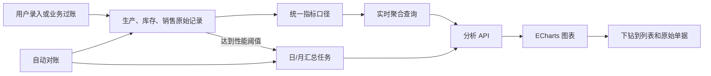

### 14.2 分析维度

| 维度 | 示例 | 用途 |
|---|---|---|
| 时间 | 日、周、月、季度、生产周期 | 趋势、同比和环比 |
| 组织 | 农场 | 数据隔离和跨农场比较 |
| 养殖 | 品种、批次、圈舍、生产模式 | 存栏、生产效率和成本比较 |
| 种植 | 作物、品种、地块、种植周期 | 亩产、投入和利润比较 |
| 库存 | 仓库、物料分类、物料、批号 | 余额、消耗、周转和临期分析 |
| 往来 | 供应商、客户 | 采购、销售和应收应付分析 |
| 人员 | 负责人、操作人 | 工作量、完成率和审计，不用于不透明绩效评价 |

### 14.3 核心指标口径

所有指标在 `analytics` 模块维护唯一口径、版本、单位、说明和数据来源。分母为零或数据不足时返回 `null` 和原因，不伪装成 0。

| 指标 | 计算口径 | 数据来源 | 注意事项 |
|---|---|---|---|
| 当前库存 | 已过账库存流水 `quantity_delta` 合计 | 库存流水 | 必须与余额缓存一致 |
| 库存金额 | 当前数量 × 移动平均成本 | 库存余额、入库价格 | 负库存默认禁止 |
| 当前存栏 | 批次全部确认数量变动合计 | 养殖数量流水 | 场内转舍不改变全场总数 |
| 死亡率 | 死亡数量 ÷ 入栏及后续引入数量 × 100% | 数量流水 | 分母口径在页面说明 |
| 平均日增重 ADG | 最近均重减入栏均重 ÷ 间隔天数 | 称重记录 | 样本称重需显示样本数 |
| 料肉比 FCR | 累计饲料重量 ÷ 批次估算总增重 | 饲喂、称重、销售重量 | 缺失死亡或销售重量时标记“估算” |
| 头均生产成本 | 批次生产成本 ÷ 已出栏头数 | 领用、费用、销售 | 活动批次显示暂估值 |
| 亩产 | 净采收重量 ÷ 实际种植面积 | 采收批次、种植周期 | 面积变化需保留记录 |
| 亩成本 | 周期总成本 ÷ 实际种植面积 | 农事投入、人工、费用 | 区分直接和分摊成本 |
| 等级占比 | 某等级数量 ÷ 已分级总量 × 100% | 分级记录 | 未分级量单独显示 |
| 库存周转率 | 期间耗用或销售成本 ÷ 平均库存金额 | 库存、成本 | 周期不足时不做年化误导 |
| 毛利 | 已过账销售收入减直接成本和已分摊成本 | 销售、成本 | 与现金净流入不是同一指标 |
| 现金净流入 | 已收款减已付款 | 收付款 | 不等同利润 |
| 任务完成率 | 期间按时完成任务数 ÷ 到期任务数 | 任务 | 自动取消任务不计分母 |

### 14.4 看板与图表规划

| 看板 | KPI | 主要图表 | 下钻目标 |
|---|---|---|---|
| 综合经营 | 猪鸡存栏、作物面积、库存预警、月收入、月成本、毛利 | 收入成本趋势、业务构成、近期异常 | 对应批次、周期、库存或单据列表 |
| 生猪分析 | 存栏、死亡率、均重、ADG、FCR、头均成本 | 存栏折线、批次对比柱图、成本堆叠柱图、均重趋势 | 猪批次详情和原始记录 |
| 鸡养殖分析 | 存栏、死亡率、日龄、饲料消耗、批次成本 | 批次趋势和对比 | 鸡批次详情 |
| 种植分析 | 面积、总产量、亩产、亩成本、预计和实际进度 | 地块或作物柱图、成本结构、产量趋势 | 种植周期和农事记录 |
| 烟草分析 | 采收量、烘烤得率、等级占比、亩收入 | 烘烤批次对比、等级横向条形图 | 烘烤与分级记录 |
| 库存分析 | 库存金额、低库存数、临期数、期间入出库 | 入出库趋势、消耗排行、库存结构 | 库存流水和来源单据 |
| 利润分析 | 收入、直接成本、分摊成本、毛利、现金净流入 | 收入成本组合图、批次或地块利润排行 | 销售、付款和成本来源 |

图表选择规则：

- 时间变化使用折线图；不同对象比较使用横向或纵向柱图。
- 成本组成使用堆叠柱图；分类过多时不使用饼图。
- 相关性分析只有在样本量和业务解释充分时使用散点图。
- 不使用仪表盘装饰普通百分比；KPI 数值和目标进度更清楚。
- 图表标题必须说明指标、单位和时间范围，Tooltip 显示精确值。
- 图表颜色不能同时承担类别和好坏两种含义。

### 14.5 分析 API 约定

阶段 3 已落地 `GET /api/v1/inventory-analysis`，必传 `farmId`，可按 `warehouseId` 筛选；`expiryDays` 支持 1-365 天且默认 30 天，`trendDays` 支持 7-90 天且默认 30 天。接口在后端校验当前用户的农场访问范围，并返回汇总指标、逐日金额趋势、临期/过期批次、生产净耗用前五名、实际统计周期和生成时间。

库存分析只聚合 `POSTED` 流水。效期预警按“仓库 + 物料 + 批号”汇总当前正库存，以该批次有效期判断临期或过期；每日入库与出库金额分别按正、负流水的绝对数量乘流水单位成本计算；生产净耗用按同期 `PRODUCTION_ISSUE` 减 `PRODUCTION_RETURN` 计算。没有业务的日期补零，保证 ECharts 时间轴连续。该接口不维护第二套统计表，当前数据量下以实时聚合换取口径单一和可核对性。

示例：`GET /api/v1/analytics/livestock/trends?farmId=1&from=2026-01-01&to=2026-08-14&species=pig`

```json
{
  "success": true,
  "data": {
    "metric": "livestock_head_count",
    "metricVersion": "1.0",
    "unit": "head",
    "filters": {
      "farmId": 1,
      "from": "2026-01-01",
      "to": "2026-08-14",
      "species": "pig"
    },
    "series": [
      { "date": "2026-08-13", "value": "120.000" },
      { "date": "2026-08-14", "value": "118.000" }
    ],
    "generatedAt": "2026-08-14T12:00:00Z"
  },
  "requestId": "req_04"
}
```

### 14.6 数据质量与分析可信度

1. 只有 `POSTED` 业务记录进入正式指标。
2. 数量、金额、面积、日期和单位在写入边界校验。
3. 图表必须能下钻到计算来源，导出结果包含筛选条件和生成时间。
4. 样本称重、估算成本和缺失数据必须带质量标记。
5. 每日自动检查库存余额、批次存栏、分级量、销售金额和汇总表。
6. 指标公式修改必须升级 `metricVersion` 并记录生效日期。
7. 禁止为了让图表“好看”而修改、平滑或隐藏真实异常数据。

## 15. 分阶段开发计划

阶段工期为单人开发的粗略工作日估算，不包含等待业务确认和大量历史数据整理的时间。每个阶段都要经过需求确认、数据库迁移、后端、前端、分析、自动化测试和实际数据验收。

| 阶段 | 预计 | 主要交付 | 数据库或迁移 | 分析交付 | 阶段退出条件 |
|---|---:|---|---|---|---|
| 0. 当前基线 | 已完成 | 登录、注册、会话、MySQL、Nginx | 现有 `users` | 无 | 认证测试通过，现有用户可登录 |
| 1. 架构升级 | 7-10 天 | Vue 3、Element Plus、路由、Pinia；Flask 应用工厂、模块骨架、统一响应、Waitress | `0001`、`0002` | ECharts 通用容器、分析 API 契约 | 现有用户和认证行为无损迁移；前后端构建、MySQL 集成和 E2E 通过 |
| 2. 基础资料与权限 | 已完成 | 农场、成员、圈舍、地块、仓库、单位、品类、品种、两层物料分类、物料、角色 | `0003`、`0004`、`0005` | 工作台基础资源和待办骨架 | 农场数据隔离有效；管理员能配置完整生产基础资料 |
| 3. 采购与库存 | 已完成 | 采购入库、采购退货、仓库调拨、生产领退料、库存盘点、效期预警和库存分析 | `0006`、`0007`、`0008`、`0009` 已上线；分析无新增迁移 | 库存余额、金额、低库存、效期预警、入出库金额趋势和生产净耗用排行 | 采购、退货、领用和盘点闭环；流水与余额 100% 对账；重复提交不重复记账；图表与明细一致 |
| 4. 生猪管理 | 进行中 | 批次、存栏、饲喂领料、健康/防疫/用药、称重和 ADG 已完成；继续开发 FCR 和完整批次成本 | `0010_livestock` 已上线；`0011_livestock_production` 已实现 | 当前存栏、减员/出栏 KPI、最近均重、ADG 和饲料成本已完成；趋势、死亡率、FCR、完整成本待开发 | 使用真实示例完整关闭一批猪；库存、存栏、成本和销售可追溯 |
| 5. 通用种植与烟草 | 12-15 天 | 地块周期、农事、投入、人工、采收、烘烤、分级 | `0011`（规划） | 面积、亩产、亩成本、烘烤得率和等级结构 | 完整关闭一个烟草周期；面积、投入、采收和等级约束全部成立 |
| 6. 鸡与其他作物 | 8-10 天 | 肉鸡批次；大蒜、水稻、油菜模板和关键作业 | 对既有模型作必要增量迁移 | 品类、批次、地块和周期横向对比 | 新品类通过共享模型运行，未复制整套库存、销售或成本模块 |
| 7. 销售与经营核算 | 10-12 天 | 客户、销售、退货、收付款、其他成本和分摊 | `0012`（规划） | 收入、成本、毛利、现金净流入和利润排行 | 任一销售、成本和利润均可下钻；销售与库存、存栏或产量联动 |
| 8. 综合分析与协同 | 8-10 天 | 任务、提醒、附件、审计查询、导出、综合驾驶舱 | `0013`；必要时 `0014` | 五类分析看板、指标说明、下钻和导出 | 指标对账通过；提醒幂等；导出与页面筛选一致 |
| 9. 发布加固 | 5-7 天 | 备份恢复、安全、性能、日志、安装升级和用户操作文档 | 全迁移复验 | 大数据集性能和汇总重算 | 空机安装、旧库升级、备份恢复、桌面和手机回归全部通过 |

### 15.1 阶段 1 特别目标

阶段 1 是后续开发的前置门槛，不能在认证迁移尚不稳定时并行堆叠业务模块。必须完成：

- Vue 新登录、注册和工作台框架与当前行为等价。
- 现有 MySQL 用户 ID、账号、姓名、角色、密码哈希和时间不丢失。
- `backend/app.py` 的功能迁移到应用工厂和 `auth` 模块。
- 建立 `/api/v1`、统一错误、请求编号、CSRF 和权限装饰器。
- 建立前后端质量命令和一键自动化测试入口。
- Nginx 改为服务 Vite 生产构建，并由 Waitress 承载 Flask。

### 15.2 每阶段的数据分析交付定义

一个业务阶段只有同时满足以下条件，才算分析能力完成：

1. 指标名称、公式、单位、时间范围和异常口径写入指标字典。
2. 后端分析查询按农场权限过滤，并有固定数据集测试。
3. 前端至少包含 KPI、一个趋势或对比图和明细下钻。
4. 图表具备加载、空数据、错误、响应式和导出状态。
5. 自动化测试将图表汇总值与业务记录独立计算结果对比。

## 16. 自动化测试与质量门禁

### 16.1 当前测试基线

截至 2026-08-16，统一测试入口为 `scripts/test.ps1`，最近一次完整结果如下：

1. Ruff 通过；pytest 共 27 项通过，MySQL 选择性用例在普通运行中跳过 1 项。
2. 独立连接 `agriculture_management_test` 的 MySQL 集成测试 1 项通过。
3. ESLint、Vue TypeScript 类型检查和 Vite 生产构建通过；Vitest 4 项通过，其中本地业务日期用例覆盖 UTC 跨日边界风险。
4. Playwright 在桌面 Chrome 与 Pixel 7 两种项目下共 6 项通过，覆盖注册登录、管理员用户管理，以及四角色从建档授权到采购库存、库存分析、生猪入栏、转舍、死亡、淘汰、出栏和只读核账的跨模块闭环；同时验证图表非空像素、页面脚本异常、非预期 HTTP 失败、整页横向溢出和手机紧凑批次行。
5. `inventory-reconcile` 确认测试库和正式库库存余额均与已过账流水一致；正式环境健康检查、管理员登录、农场列表、库存分析和空生猪批次列表只读烟雾验证通过。

SQLite 承担快速接口与业务测试，但不能替代 MySQL 的事务、排序规则、约束、锁和迁移集成测试。浏览器 E2E 和 MySQL 集成测试必须显式连接以 `_test` 结尾的数据库。

### 16.2 测试分层

| 测试层 | 工具 | 关注内容 | 执行频率 |
|---|---|---|---|
| 静态检查 | Ruff、ESLint、TypeScript | 语法、格式、未使用代码、明显类型错误 | 每次提交前 |
| 后端单元测试 | pytest | 公式、状态转换、校验、权限判断、纯业务服务 | 每次提交前 |
| MySQL 集成测试 | pytest + 独立 MySQL 测试库 | 迁移、约束、事务、锁、API、查询和回滚 | 每次功能合并前 |
| 前端单元测试 | Vitest + Vue Test Utils | 组件状态、表单校验、Store 和图表数据转换 | 每次功能合并前 |
| API 契约测试 | pytest 或生成的契约检查 | 字段、状态码、错误码、分页和权限 | 每个接口变更 |
| E2E 冒烟测试 | Playwright | 登录和每个模块最关键的成功路径 | 每次功能合并前 |
| E2E 全量测试 | Playwright | 正常、异常、权限、移动端和跨模块闭环 | 每阶段验收 |
| 视觉检查 | Playwright 截图 | 桌面与手机布局、溢出、遮挡和关键状态 | 每阶段验收 |
| 数据对账 | pytest / Flask CLI | 库存、存栏、产量、销售、成本和汇总一致性 | 每阶段验收和定时运行 |
| 安全测试 | 自动用例 + 人工检查 | 越权、CSRF、SQL 注入、上传、会话和敏感信息 | 每阶段及发布前 |
| 性能测试 | 可重复数据脚本 | 列表、看板、过账和导出耗时 | 阶段 8、9 |
| 恢复演练 | 备份恢复脚本 | 数据库、附件、配置和版本恢复 | 发布前及定期运行 |

### 16.3 测试环境隔离

- 开发库：开发人员日常使用，可以保存手工演示数据。
- 自动化测试库：固定命名为 `agriculture_management_test`，每次运行前校验库名，绝不连接生产库。
- 验收库：从匿名化或构造的接近真实数据恢复，用于浏览器、性能和升级测试。
- 生产库：自动化测试不得创建、清空或修改生产业务数据。
- 文件上传测试使用独立临时目录，执行完成自动清理。
- 配置文件只保留测试账号，不复用生产数据库凭据。

### 16.4 每阶段统一自动化流程

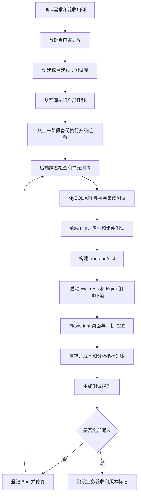

### 16.5 当前统一测试命令

`scripts/test.ps1` 已作为统一入口，遇到任何一步失败都会返回非零退出码：

```powershell
# Ruff、pytest、ESLint、Vitest、类型检查和生产构建
.\scripts\test.ps1

# MySQL 集成和浏览器测试，仅允许测试库
$env:AGRI_MYSQL_DATABASE = "agriculture_management_test"
.\stop.ps1
.\start.ps1
.\scripts\test.ps1 -MySql -E2E
.\stop.ps1
Remove-Item Env:AGRI_MYSQL_DATABASE
```

E2E 会创建测试用户和业务单据，禁止在正式库上运行。发布到正式库后只执行健康检查、只读页面烟雾测试、`schema-check` 和 `inventory-reconcile`。

### 16.6 各阶段专项自动化测试

| 阶段 | 必测内容 |
|---|---|
| 1. 架构升级 | 现有账号登录；注册策略；Cookie、CSRF、会话过期；旧 URL 处理；空库和现有库迁移；Nginx 静态资源和 API |
| 2. 基础资料 | 农场隔离；角色矩阵；编号唯一；无权限写入；停用资料不能用于新业务；手机端导航 |
| 3. 库存采购 | 采购过账、重复过账、退货、调拨、领退料成本对象、部分退料、累计超退拦截、盘盈盘亏、负库存阻止、并发扣减、余额与流水对账、临期和低库存 |
| 4. 生猪 | 当前已覆盖入栏、转舍、死亡、淘汰、分批出栏、存栏公式、容量、日期顺序、幂等和关闭条件；后续补饲料/药品扣减、ADG、FCR 和批次成本 |
| 5. 种植烟草 | 地块面积占用、农事投入、多投入品领用、分批采收、等级数量约束、烘烤得率、亩产和亩成本 |
| 6. 鸡和其他作物 | 猪鸡数据不串；共享养殖流程；作物模板生成任务；四种作物指标和单位正确 |
| 7. 销售经营 | 销售过账和冲销；库存或存栏变化；金额舍入；收付款；成本分摊；毛利与现金指标区分 |
| 8. 综合分析 | 每个图表筛选、空数据、下钻、导出；汇总重算幂等；任务重复生成；附件安全；审计完整 |
| 9. 发布加固 | 安装、升级、备份恢复、权限渗透、超时、大数据分页、并发过账、桌面和手机全量回归 |

### 16.7 固定测试与模拟业务数据集

测试种子至少包含：

- 2 个农场、4 种角色，用于验证跨农场和越权。
- 2 个仓库、饲料、兽药、种子、肥料、农药和农产品物料。
- 正常库存、零库存、低库存、临期和库存不足场景。
- 2 个猪批次，其中一个活动、一个已关闭；1 个肉鸡批次。
- 烟草、大蒜、水稻、油菜各 1 个周期，包含部分和完整采收场景。
- 采购、销售、收付款、冲销和费用记录。
- 同日多次记录、跨月周期、零分母、缺失称重等分析边界数据。

固定数据集的编号、业务数量、金额和预期指标写在测试 Fixture 中，不能依赖执行时的当前日期和无固定种子的随机数。仅用于隔离并发测试的编号后缀可以动态生成，但不得影响业务断言。

后续每个新增功能必须同时具备以下三层数据测试，不能只验证空数据或单条成功请求：

| 数据层 | 数据要求 | 必须断言 |
|---|---|---|
| 最小规则数据 | 使用最少记录覆盖公式、状态流转、权限和幂等规则 | 返回字段、错误码、状态、数量与金额精确正确 |
| 典型业务模拟 | 按真实经营过程组合农场、角色、圈舍/地块、批次、物料和连续单据 | 前端操作、API、数据库流水、余额及分析指标形成完整闭环 |
| 异常与边界模拟 | 零库存、低库存、超量、重复提交、跨农场、停用资料、未来日期、跨月和零分母 | 请求被正确拒绝或返回明确空值，事务不留下部分数据 |

模拟数据遵循以下约束：

1. 只使用虚构的人员、农场、供应商和经营数据，不复制真实家庭成员信息、电话、地址或生产账目。
2. 写入型模拟测试只能连接名称以 `_test` 结尾的数据库；正式库只允许登录和只读烟雾验证。
3. 数量、单价、日期和预期结果必须可重复计算。涉及移动平均、成本、存栏、产量或利润时，测试代码独立计算期望值，不能直接复用被测服务结果。
4. 每个阶段至少提供一条多角色端到端模拟链路，并同时覆盖桌面和手机视口；查看员必须验证结果且不能看到写操作入口。
5. 生猪、鸡、烟草、大蒜、水稻和油菜在对应模块开发时各自补充代表性模拟周期，不用一个品类的数据替代全部品类验收。
6. 失败用例结束后必须验证余额、流水和单据数量未发生意外变化；测试通过后保留截图和关键对账结果。

#### 16.7.1 当前采购退货固定模拟场景

| 层次 | 固定数据 | 关键预期 |
|---|---|---|
| 后端成本与部分退货 | 同一物料先采购 `10 × 12.345`（批号 A），再采购 `10 × 20`（批号 B）；先从主仓退批号 A 的 2，再调拨批号 A 的 8 到分仓并从分仓退 3 | 首次退款 `24.69`，库存单位成本 `16.1725`、库存减少金额 `32.35`；累计已退 5、可退 5；主仓 10、分仓 5；两条退货负流水通过余额对账 |
| 幂等与边界 | 同请求重复提交、同单号改数量、累计超退、调拨后主仓批号不足、未来日期、错误采购明细 | 相同内容返回原结果；其余分别返回 `409`、`409`、`409`、`400`、`404`，失败请求不留下部分流水 |
| 角色权限 | 管理员、负责人、操作员、查看员分别调用退货和查询能力 | 前三类可办理；查看员退货返回 `403`，但可以核对采购详情、余额和流水 |
| 桌面与手机 E2E | 采购 25、主仓调拨 10、圈舍领料 5、生产退料 2、向供应商退货 2 | 主仓 10、分仓 10、圈舍净耗用 3；采购明细已退 2、可退 23；共六条库存流水；查看员无退货按钮 |

#### 16.7.2 当前库存分析固定模拟场景

| 层次 | 固定数据 | 关键预期 |
|---|---|---|
| 后端聚合 | 当前日构造正常、临期和过期批次；生产领料 3、退料 1；同时保留另一农场数据 | 30 个连续趋势点；临期和过期分别计数；净耗用为 2、金额为 22.50；跨农场数据不可见 |
| 筛选与边界 | 分别使用仓库筛选、7 天效期窗口、非法趋势周期和非成员账号 | 仓库结果只含指定仓；短窗口排除较远有效期；非法参数返回 `400`；非成员返回 `403` |
| 桌面与手机 E2E | 采购入库 25 千克、调拨 10、领料 5、退料 2、采购退货 2、盘亏 1，并设置同一临期批号 | 入库 129.50 元、出库 63.00 元；生产净耗用 3 千克/10.50 元；主仓 9、分仓 10 均进入预警；7 天窗口清空较远批次 |
| 可视化与权限 | 操作员和查看员打开库存分析，读取趋势画布和汇总明细 | ECharts canvas 存在非透明像素；两类角色读数一致；查看员无任何库存写按钮；桌面和手机均无横向溢出 |

#### 16.7.3 当前生猪批次固定模拟场景

| 层次 | 固定数据 | 关键预期 |
|---|---|---|
| 后端存栏链 | 负责人向一舍入栏 60；操作员转二舍 20，二舍死亡 2，一舍淘汰 1、出栏 10 | 转舍前后总量均为 60；最终总存栏 47，一舍 29、二舍 18；死亡 2、淘汰 1、出栏 10；共五条流水 |
| 幂等与结批 | 同批次入栏和同流水重复提交；同单号修改数量；两舍分别出完剩余 8 和 2 | 相同内容返回原记录；不同内容返回 `409`；剩余归零后自动 `CLOSED`，后续变动被拒绝 |
| 异常与隔离 | 超来源存栏、未来/倒序日期、缺失死亡原因、跨农场圈舍、鸡舍、停用目标舍、目标舍超容量、非成员访问 | 请求分别以明确 `400`、`403` 或 `409` 拒绝，事务不留下部分流水 |
| 桌面与手机 E2E | 管理员建两个猪舍并授权；负责人入栏 60；操作员完成四种变动；查看员核对 | 汇总显示 47 头、1 个在养批次、死亡 2、淘汰/出栏 11；查看员无“批次入栏”和“登记变动”；手机批次行直接显示存栏与圈舍分布 |

### 16.8 数据对账断言

| 对账项 | 必须满足 |
|---|---|
| 库存余额 | `inventory_balances.quantity` 等于全部已过账库存流水汇总 |
| 农场存栏 | 全部活动批次数量合计等于养殖数量流水汇总 |
| 地块面积 | 同期活动周期占用面积不超过地块可用面积 |
| 分级产量 | 各等级数量合计不超过对应采收净重量 |
| 采购金额 | 订单总额等于明细金额合计，舍入规则一致 |
| 销售金额 | 销售总额等于明细合计，收款不超过允许业务范围 |
| 批次成本 | 自动领用成本加费用及分摊等于分析接口批次成本 |
| 汇总表 | 汇总指标等于从原始业务表独立重算结果 |

### 16.9 覆盖率和通过标准

- 库存、存栏、成本、权限和指标公式等核心 Service 分支覆盖率不低于 80%。
- 后端整体语句覆盖率目标不低于 75%；前端工具、Store 和业务组件目标不低于 70%。
- 覆盖率不能替代关键场景，关键过账和冲销路径必须有明确测试。
- 自动化测试必须 100% 通过，不能以“偶发失败”方式接受不稳定用例。
- 测试报告保存执行时间、代码版本、数据库迁移版本、用例总数、失败详情和截图路径。

### 16.10 性能验收目标

V1 以家庭农场和小型经营主体为目标，性能测试基线为 20 个并发会话、100,000 条库存流水、50,000 条生产记录：

| 操作 | 目标 |
|---|---|
| 健康检查 | P95 小于 100ms |
| 普通分页列表 | P95 小于 500ms |
| 单据过账 | P95 小于 1s，且不产生重复数据 |
| 常用分析接口 | P95 小于 1s |
| 综合工作台首屏 | 正常局域网下 2s 左右可操作 |
| 10,000 行以内导出 | 30s 内完成；更大导出后续改后台任务 |

性能目标未达到时先使用 `EXPLAIN`、查询日志和浏览器性能工具定位，不直接添加缓存掩盖低效查询。

## 17. Bug 管理与修复流程

### 17.1 Bug 信息要求

每个 Bug 至少记录：

- Bug 编号、标题、发现版本和发现时间。
- 环境、用户角色、农场和业务数据范围。
- 前置条件、复现步骤、实际结果和期望结果。
- 截图、请求编号、日志片段或相关单据编号。
- 严重级别、影响范围、是否涉及数据错误或安全风险。
- 修复原因、修改文件、迁移影响、测试证据和验证人。

不得在 Bug 记录中粘贴密码、Cookie、数据库连接密钥或未经脱敏的个人信息。

### 17.2 严重级别

| 级别 | 定义 | 示例 | 处理目标 |
|---|---|---|---|
| P0 阻断 | 服务不可用、数据丢失、严重安全漏洞、错误批量记账 | 无法登录、库存被重复扣减、越权查看其他农场 | 立即停止发布或相关功能，优先恢复和修复 |
| P1 严重 | 核心流程无法完成或经营数字明显错误 | 采购不能过账、批次存栏计算错误 | 当日分析并优先修复 |
| P2 一般 | 有替代路径，影响局部功能或少量用户 | 某筛选条件失效、导出格式错误 | 当前或下一个开发阶段修复 |
| P3 轻微 | 文案、间距或低影响体验问题 | 标签错字、非关键对齐问题 | 纳入常规迭代 |

### 17.3 Bug 生命周期

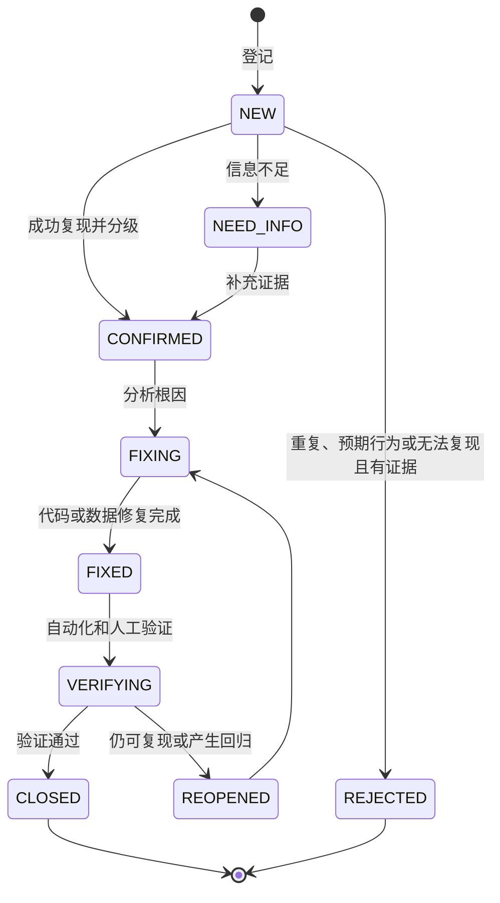

### 17.4 标准修复步骤

1. 先确认影响范围和是否需要暂停相关录入，数据风险优先于界面修复。
2. 使用日志、请求编号、业务单据和数据库只读查询稳定复现。
3. 找到根因和所有同类调用位置，不只修补用户看到的表面现象。
4. 先增加一个能复现问题且修复前失败的自动化测试。
5. 进行最小且完整的根因修复；禁止顺带进行无关重构。
6. 运行当前模块测试、跨模块关联测试和全量冒烟测试。
7. 如涉及数据，先备份，再通过版本化修复脚本或迁移纠正，禁止直接手工修改后不留记录。
8. 在验收环境重放原复现步骤，保存测试输出、截图和对账结果。
9. 更新变更记录、已知问题和必要的用户说明后关闭 Bug。

### 17.5 数据 Bug 特殊流程


数据修复脚本必须包含影响条件、预计行数、执行结果检查和幂等保护。执行行数与预计不符时立即回滚并停止。

### 17.6 热修复规则

- P0/P1 可以建立独立热修复分支，但仍必须有复现测试和最小回归。
- 热修复不得跳过数据库备份、权限检查或数据对账。
- 修复发布后必须合回主开发线，避免后续版本重新引入问题。
- 临时关闭功能时向用户显示明确状态，不返回伪造成功。

## 18. 开发工作流与完成定义

### 18.1 版本控制

当前项目尚不是 Git 仓库。阶段 1 应在排除密钥、数据库、上传、日志、构建产物和 Nginx 运行文件后初始化 Git。

建议保持简单分支策略：

- `main`：始终对应已经通过阶段验收的版本。
- `feature/<module>-<description>`：单个功能或阶段内可独立验收的改动。
- `fix/<bug-id>-<description>`：普通缺陷修复。
- `hotfix/<bug-id>-<description>`：生产阻断修复。

提交信息说明模块和结果，例如 `feat(inventory): add purchase posting`。任何提交不得包含 `mysql.json`、`secret_key`、数据库文件、用户上传或日志。

### 18.2 单个功能开发流程

1. 从需求编号和验收标准开始，明确正常、异常和权限场景。
2. 确认复用的主数据、单据和成本关系。
3. 编写数据库迁移及对应升级测试。
4. 编写后端 Schema、Service、Model 或 Query 和 API 测试。
5. 编写前端页面、API 类型、交互状态和组件测试。
6. 增加 ECharts 指标和对账测试，若该功能产生分析数据。
7. 执行统一测试脚本和真实浏览器验证。
8. 更新文档、迁移说明和变更日志。

### 18.3 Definition of Done

一个功能只有满足以下条件才算完成：

- 需求和验收标准明确，代码只实现批准范围。
- 数据库迁移可在空库和上一版本数据库成功运行。
- 后端权限、参数校验、事务、错误处理和审计已实现。
- 前端具备加载、空数据、成功、错误、无权限和移动端状态。
- 业务指标有明确口径、单位和下钻来源。
- 自动化测试通过且覆盖关键正常、边界、异常和越权场景。
- Nginx 集成环境通过桌面和手机浏览器测试。
- 没有明文密码、敏感日志、调试模式或未处理的 P0/P1 Bug。
- 文档和变更记录已同步。

### 18.4 代码审查清单

- 是否在后端强制限制了农场数据范围。
- 是否使用事务保证业务单据、库存、成本和审计一致。
- 是否可能重复过账、重复生成提醒或产生负库存。
- 是否正确处理金额、数量、单位、时区和零分母。
- 是否存在循环查询、无分页列表或无索引筛选。
- 是否返回了密码、内部异常、文件绝对路径或数据库信息。
- 是否重复创建已有组件、服务或业务表。
- 是否添加了足以捕获回归的自动化测试。
- 页面是否具备可用的加载、错误、空状态和操作确认。

## 19. 环境、启动与部署设计

### 19.1 当前版本启动方式

当前代码已完成 Vue 3、SQLAlchemy、Alembic 和 Waitress 改造。启动脚本会检查前端构建产物，启动 Waitress，验证 Nginx 配置，并检查后端健康接口和首页：

```powershell
Set-Location D:\zongheguanlixitong
python -m pip install -r requirements.txt
powershell.exe -NoProfile -ExecutionPolicy Bypass -File .\start.ps1
```

浏览器访问：`http://localhost:8080`

健康检查：`http://localhost:8080/api/health`

停止服务：

```powershell
Set-Location D:\zongheguanlixitong
powershell.exe -NoProfile -ExecutionPolicy Bypass -File .\stop.ps1
```

### 19.2 当前开发流程

当前开发与构建使用以下流程：

```powershell
# 后端依赖和数据库迁移
python -m pip install -r requirements.txt
python -m flask --app backend.wsgi:app db upgrade

# 前端开发
Set-Location frontend
npm.cmd install
npm.cmd run dev

# 前端生产构建
npm.cmd run build
```

开发数据库迁移只能使用明确配置的开发管理员账号；执行迁移前命令必须显示目标主机、数据库名称和迁移版本，但不能显示密码。

### 19.3 集成启动流程

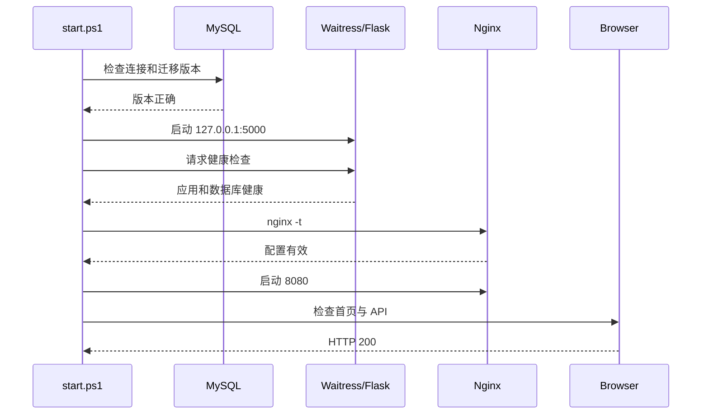

启动脚本必须在数据库迁移版本落后时明确退出，不能让新代码在旧表结构上继续运行。脚本也不能自动使用受限应用账号执行未知 DDL。

### 19.4 环境配置

| 配置 | 用途 | 要求 |
|---|---|---|
| `AGRI_ENV` | `development`、`test`、`production` | 生产环境禁止调试模式 |
| `AGRI_SECRET_KEY` | Flask 会话签名 | 高强度随机值，不进入版本库 |
| `AGRI_MYSQL_*` | MySQL 主机、端口、用户、密码、数据库和 TLS | 各环境独立账号，最小权限 |
| `AGRI_UPLOAD_DIR` | 附件目录 | 使用项目受控目录，不接受用户输入绝对路径 |
| `AGRI_MAX_UPLOAD_MB` | 单文件大小限制 | V1 建议默认 10MB，可按实际调整 |
| `AGRI_LOG_LEVEL` | 日志级别 | 生产默认 INFO，不记录敏感字段 |
| `AGRI_COOKIE_SECURE` | HTTPS Cookie | 公网和 HTTPS 环境必须开启 |

本机可以继续从 `backend/instance/mysql.json` 读取数据库配置，但该文件必须被 `.gitignore` 排除。文档、日志和错误响应均不得输出其中密码。

### 19.5 Nginx 目标职责

- 从 `frontend/dist` 提供带正确 MIME 的静态资源。
- `/api/` 反向代理到本机 Waitress，不直接暴露 5000 端口。
- SPA 路由回退到 `index.html`，API 404 不得回退为 HTML。
- 为带哈希名的 JS/CSS 设置长期缓存，为 `index.html` 设置不缓存或短缓存。
- 设置内容类型、防点击劫持、Referrer Policy 和合理的 Content Security Policy。
- 限制请求体大小，对登录接口限速，设置连接和读取超时。
- 使用独立 access/error 日志并配置日志轮转。
- 公网部署时终止 HTTPS，并把协议和真实客户端地址传给 Flask。

### 19.6 运行检查

| 检查项 | 正常标准 |
|---|---|
| 进程 | MySQL、Waitress、Nginx 均存在且 PID 与记录一致 |
| 端口 | MySQL 仅按需要开放；5000 仅本机；8080 或 443 对用户开放 |
| 健康 | `/api/health` 返回服务名、数据库类型和成功状态，不泄露版本和密钥 |
| 日志 | 无持续 5xx、数据库重连、权限或磁盘写入错误 |
| 磁盘 | 数据库、附件、日志和备份均有足够空间 |
| 备份 | 最近一次备份成功且文件非零，定期恢复验证通过 |
| 时间 | Windows、MySQL 和应用时区规则一致，系统时间同步 |

## 20. 备份、恢复与数据保留

### 20.1 备份内容

- MySQL `agriculture_management` 的一致性逻辑备份。
- `backend/instance/uploads` 中的业务附件。
- Nginx、环境变量示例和非敏感配置。
- 与备份对应的应用版本、迁移版本和校验值。
- 不把运行日志当作业务备份，也不把历史 SQLite 当作持续 MySQL 备份。

### 20.2 建议保留策略

| 类型 | 频率 | 保留 |
|---|---|---|
| 迁移前备份 | 每次数据库迁移前 | 至少保留到新版本稳定验收完成 |
| 每日备份 | 每天业务结束后 | 最近 7 份 |
| 每周备份 | 每周 | 最近 4 份 |
| 每月备份 | 每月 | 最近 12 份 |
| 恢复演练 | 每月或重要版本发布前 | 保存演练报告 |

至少一份备份应保存在不同磁盘或加密外部存储中；同一硬盘上的备份不能应对硬盘损坏。目标恢复点 RPO 为 24 小时以内，目标恢复时间 RTO 为 2 小时以内。

### 20.3 恢复步骤

1. 停止写入并记录故障时间、应用版本和数据库版本。
2. 复制当前故障数据作证据，不直接覆盖唯一现场。
3. 在隔离环境创建空数据库并恢复选定备份。
4. 校验数据库结构、表数量、关键行数和附件清单。
5. 使用备份对应应用版本启动并运行自动化冒烟与数据对账。
6. 如需升级，按迁移顺序升级并再次测试。
7. 业务负责人抽查最近猪批次、地块周期、库存和销售数据。
8. 切换正式服务，记录恢复点、丢失窗口和后续补录事项。

## 21. 非功能需求

| 类别 | V1 要求 |
|---|---|
| 易用性 | 高频录入步骤短、中文业务术语清楚、提供默认值和操作影响提示 |
| 兼容性 | 支持近期稳定版 Edge、Chrome；手机浏览器支持核心查询和录入 |
| 性能 | 满足第 16.10 节目标，所有列表后端分页 |
| 安全 | 最小权限、CSRF、Cookie 安全、参数校验、审计、备份和敏感信息保护 |
| 可靠性 | 单据事务原子性、幂等过账、冲销机制和数据对账 |
| 可维护性 | 模块化单体、迁移版本、统一 API、静态检查和自动化测试 |
| 可扩展性 | 新相似品类复用批次或周期模型，专业差异通过专用扩展表实现 |
| 可观测性 | 请求编号、结构化日志、健康检查、慢查询和任务执行记录 |
| 可恢复性 | 每日备份、异盘副本、定期恢复演练，RPO/RTO 明确 |
| 数据质量 | 标准单位、精确数值、状态控制、来源关联、指标版本和异常提示 |

## 22. 风险与应对

| 风险 | 影响 | 应对措施 |
|---|---|---|
| 真实生产模式未确认 | 猪或鸡模型返工 | V1 默认育肥猪和肉鸡；对应阶段前用真实纸质记录确认字段 |
| 用户认为录入繁琐 | 数据不完整，分析失真 | 高频快速录入、模板、默认值和移动端优化，只收集有用途的数据 |
| 单位混乱 | 库存和成本错误 | 建立单位维度和换算规则，页面始终显示单位，禁止隐式换算 |
| 库存和业务重复记账 | 余额、成本和利润错误 | 单据过账幂等、事务写入、流水对账和冲销机制 |
| 指标口径变化 | 历史图表不可比较 | 指标字典和版本，修改口径记录生效日期 |
| 农村网络不稳定 | 公网系统难使用 | V1 优先本机或局域网；离线同步在数据冲突方案明确后再做 |
| 附件持续增长 | 磁盘占满、备份变慢 | 大小限制、压缩、容量监控和可替换存储接口 |
| 依赖升级破坏构建 | 无法复现或页面异常 | 锁文件、固定 Python 依赖范围、阶段性升级和自动回归 |
| 数据库迁移失败 | 服务不可用或数据受损 | 管理员迁移、迁移前备份、空库和升级库双测试 |
| 权限遗漏 | 跨农场泄露或误操作 | 所有查询服务端限制 `farm_id`，权限集成测试覆盖四种角色 |
| 图表多但不可行动 | 增加维护成本，没有决策价值 | 每张图明确问题、指标和下钻目标，无用途图表不开发 |

## 23. V1 最终验收场景

### 23.1 端到端场景

| 场景 | 验收过程 | 必须结果 |
|---|---|---|
| E2E-01 认证与权限 | 管理员建农场和用户，操作员登录，查看者尝试修改 | 会话稳定；菜单和后端权限一致；越权返回 403 |
| E2E-02 库存闭环 | 采购饲料入库、猪批次领用、退回、盘点和冲销 | 每一步流水明确；余额与汇总一致；成本自动关联 |
| E2E-03 生猪闭环 | 入栏、转舍、饲喂、防疫、称重、死亡、分批销售和关闭 | 存栏清零；FCR、成本和毛利可解释并下钻 |
| E2E-04 烟草闭环 | 建地块周期、农事投入、采收、烘烤、分级和销售 | 面积、库存、产量、等级、亩成本和利润一致 |
| E2E-05 多品类复用 | 建肉鸡、大蒜、水稻和油菜周期并录入核心事件 | 不新增重复供应商、仓库、销售和成本功能 |
| E2E-06 分析与导出 | 切换日期和农场，查看五类看板并下钻和导出 | 图、表、导出数字一致；无权数据不可见 |
| E2E-07 故障恢复 | 在空环境恢复数据库和附件并升级到当前版本 | 服务可启动；登录、对账和抽查通过 |

### 23.2 发布检查清单

- [ ] 文档范围和默认业务假设已由实际使用者确认。
- [ ] 所有数据库迁移在空库和上一版本备份上通过。
- [ ] 后端、前端、MySQL 集成和 Playwright 测试全部通过。
- [ ] 核心库存、存栏、产量、销售、成本和分析指标完成对账。
- [ ] 桌面和手机关键页面无文字溢出、遮挡和不可操作控件。
- [ ] 角色权限、跨农场隔离、CSRF、上传和登录限制验证通过。
- [ ] Nginx 使用生产构建，Flask 不以调试服务器对外运行。
- [ ] 数据库密码、Session 密钥、日志、备份和附件未进入版本库。
- [ ] 迁移前备份已完成，恢复演练有记录。
- [ ] P0、P1 Bug 为零；允许遗留的 P2、P3 有明确影响和计划。
- [ ] README、用户操作说明、管理员手册和变更记录已更新。

## 24. 开发前仍需业务确认的事项

这些问题不会阻止阶段 1 架构升级，但必须在对应业务阶段开始前确认：

| 问题 | 当前默认 | 最迟确认阶段 |
|---|---|---|
| 生猪是否包含母猪繁育 | 否，先做育肥批次 | 阶段 4 前 |
| 鸡是肉鸡、蛋鸡还是两者都有 | 先做肉鸡 | 阶段 6 前 |
| 猪、鸡、圈舍的大致规模 | 按小型经营主体设计 | 阶段 3 性能数据准备前 |
| 各类土地面积及是否存在套种 | 默认单周期占用，可按面积分区 | 阶段 5 前 |
| 物料常用计量和换算 | kg 为重量基础单位，页面可显示斤 | 阶段 2 前 |
| 成本分摊规则 | 直接成本归对象，公共成本按面积、存栏或人工规则分摊 | 阶段 7 前 |
| 是否导入历史纸质或 Excel 数据 | V1 默认从上线日开始录入 | 阶段 2 前 |
| 需要多少用户及各自职责 | 四种内置角色 | 阶段 2 前 |
| 是否仅本机使用或局域网多人使用 | 优先本机和家庭局域网 | 阶段 9 前 |

## 25. 后续版本方向

### 25.1 已确认的近期优化顺序

1. 完成生猪生产分析：以现有饲喂、健康和称重记录为基础，补齐 FCR 与批次完整成本。
2. 建设客户、销售、收付款和成本核算，闭合“采购—生产—销售—利润”。
3. 优化手机快速录入，并按试点反馈评估 PWA、微信入口和弱网能力。
4. 增加 Excel 导入导出、备份恢复、审计查询和经营周期归档。
5. 选择 2–5 个真实家庭农场或小型合作社，连续运行一个完整生产周期，以真实流程收敛产品。

以上工作始终以家庭农场、小型合作社或单一经营主体为主要用户，不提前引入大型集团所需的多公司账套、复杂审批链和重型基础设施。

### 25.2 稳定运行后的扩展方向

V1 稳定运行并积累真实数据后，按实际收益选择后续功能：

1. 母猪个体档案、配种、妊娠、分娩、仔猪批次和谱系。
2. 蛋鸡批次、日产蛋、破损率、蛋品分级和淘汰。
3. 天气预报、农事建议、病虫害和极端天气提醒。
4. 温湿度、氨气、水电、料塔和自动饲喂设备接入。
5. 二维码批次追溯、客户查看页和合格证。
6. PWA 或移动 App、拍照识别和弱网离线录入。
7. 多经营主体、订阅计费和更细粒度权限。
8. 数据量达到实际阈值后，引入专用分析数据库或消息处理。

这些方向不是 V1 预留空代码的理由。V1 只保证数据模型和模块边界能够合理演进。

## 26. 术语表

| 术语 | 含义 |
|---|---|
| 农场 | 数据权限和业务资源的基本范围，可代表一个家庭经营主体或场区 |
| 主数据 | 圈舍、地块、仓库、物料、供应商等被多个业务复用的基础资料 |
| 养殖批次 | 同一生产目的、相近入栏时间并按群体管理的一组动物 |
| 种植周期 | 某地块或部分面积从计划、种植到采收结算的一次生产过程 |
| 过账 | 将草稿单据确认为正式业务事实，并影响库存、成本或收入 |
| 冲销 | 通过反向记录抵消已过账记录，不删除原始历史 |
| 成本对象 | 接收成本的养殖批次、种植周期、圈舍、地块或农场 |
| 下钻 | 从汇总指标或图表进入组成它的明细和原始单据 |
| ADG | Average Daily Gain，平均日增重 |
| FCR | Feed Conversion Ratio，料肉比 |
| RPO | 可接受的数据恢复点，即最多可丢失多长时间的数据 |
| RTO | 故障后恢复系统服务的目标时间 |
| RBAC | 基于角色的访问控制 |
| DDL | 建表、改表等数据库结构操作 |
| DML | 查询、插入、更新和删除等业务数据操作 |

## 27. 参考资料

- [Vue 3](https://cn.vuejs.org/)
- [Vite](https://cn.vite.dev/)
- [Element Plus](https://element-plus.org/zh-CN/)
- [Apache ECharts](https://echarts.apache.org/zh/index.html)
- [Flask](https://flask.palletsprojects.com/)
- [SQLAlchemy](https://docs.sqlalchemy.org/)
- [Alembic](https://alembic.sqlalchemy.org/)
- [MySQL](https://dev.mysql.com/doc/)
- [Nginx](https://nginx.org/en/docs/)
- [Playwright](https://playwright.dev/)

---

**文档结论：** V1 采用 Vue 3、Element Plus、ECharts、Flask 模块化单体、SQLAlchemy、MySQL、Waitress 和 Nginx。开发从“阶段 1：架构升级”开始，任何业务阶段都必须同时完成数据记录、经营指标、可视化、下钻、自动化测试和实际数据验收。
